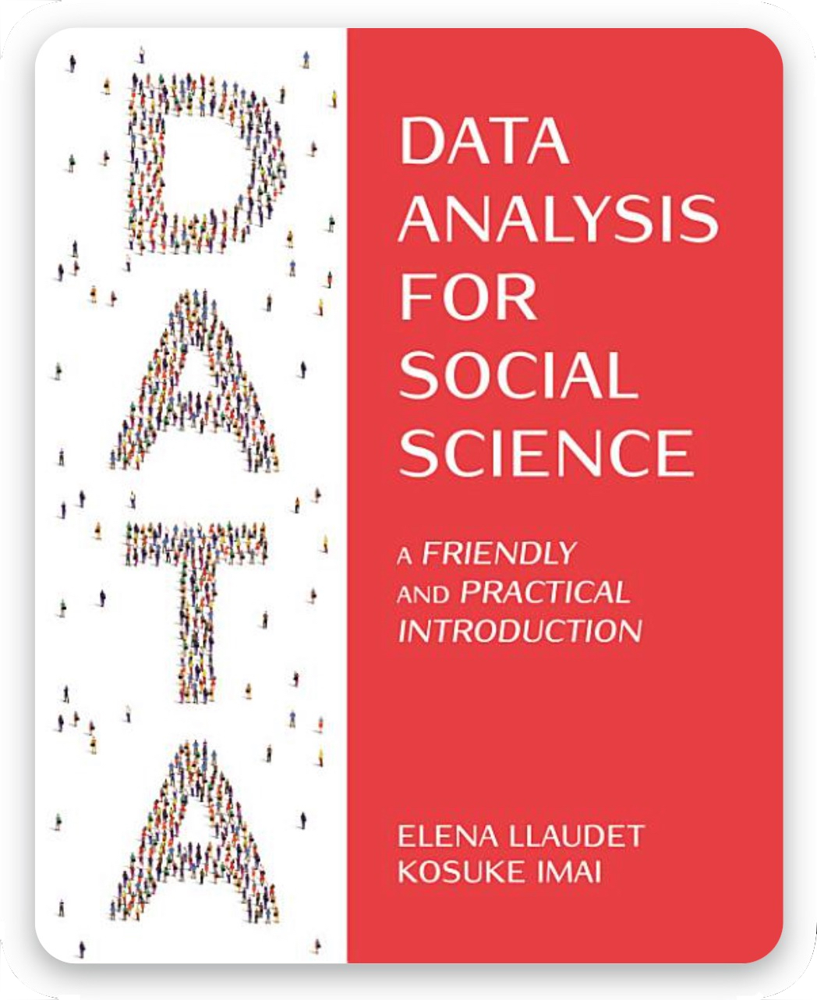

```{r setup, include=FALSE}
library(gradethis)
library(learnr)
tutorial_options(exercise.checker = gradethis::grade_learnr, 
                 exercise.reveal_solution = TRUE,
                 exercise.error.check.code = "grade_code()")
knitr::opts_chunk$set(echo = FALSE)
chapter_id <- "Chapter 2"
num_tutorial <- 58
```

<style>

.tutorial-question .panel-body { padding: 6px 15px; }

.tutorial-question-container {
  margin-bottom: 10px;
}

.borderexample {
 border-width:1px;
 border-style:solid;
 border-color:dodgerblue;
 padding: 10px;
}
</style>

<style>
table, td, th {
  border: 1px solid lightgray;
}

table {
  border-collapse: collapse;
  width: 100%;
  margin-bottom: 20px;
  margin-top: 15px;
}

td { text-align: center;}
th { text-align: center;}
th, td { padding: 15px; }
</style>


## <span style=color:white> OVERVIEW

<div style="overflow: auto;">

     
***What are these tutorials and how to use them?*** These tutorials are meant for students using DSS: <a href="https://ellaudet.github.io/dss_book/" style="color: inherit;">Llaudet and Imai's <i>Data Analysis for Social Science: A Friendly and Practical Introduction</i></a>.

They are designed to be completed *after* reading and performing the analyses explained in the book — they are meant to supplement, not replace, the book.
Each includes multiple-choice questions and hands-on coding exercises, with instant feedback so students can check their understanding on their own. At the end, students can generate a progress report of their work. The questions are organized into topics, 
each covering a handful of pages from the book that can be read in one sitting. Here is the recommended sequence:

<table>
  <tr>
    <th><span style=color:lightgray>$\blacktriangleright$ </span><span style=color:gray>  STEP 1  <span style=color:lightgray> $\blacktriangleright$ </span></th>
    <th><span style=color:lightgray> $\blacktriangleright$  </span><span style=color:gray>  STEP 2  <span style=color:lightgray> $\blacktriangleright$ </span></th>
    <th> <span style=color:lightgray> $\blacktriangleright$  </span><span style=color:gray>  STEP 3 <span style=color:lightgray> $\blacktriangleright$</span></th>
    <th> <span style=color:lightgray> $\blacktriangleright$  </span><span style=color:gray>  STEP 4 <span style=color:lightgray> $\blacktriangleright$</span></th>
  </tr>
  <tr>
<td> read the section(s) for a topic </td>
<td> perform the analyses on your computer </td>
<td> complete the review exercises </td>
<td> move on to the next topic </td>
  </tr>
</table>
</div>

***What does this particular tutorial cover?*** This is the tutorial for chapter 2, where we learn what causal effects are and how to estimate them using randomized experiments. The review exercises for this chapter are organized into two topics:

<table>
  <tr>
    <th><span style=color:gray> Topic </span></th>
    <th><span style=color:gray> Readings </span></th>
    <th><span style=color:gray> Key Concepts and Notation </span></th>
    <th><span style=color:gray> R Functions and Operators </span></th>
  </tr>
  <tr>
    <td> Estimating Causal Effects with Randomized Experiments </td>
    <td>2-2.4</td>
    <td>  causal relationships, treatment (X) vs. outcome variables (Y), potential outcomes, factual vs. counterfactual outcomes, fundamental problem of causal inference, individual vs. average causal effects, randomized experiments, random treatment assignment, treatment and control groups, pre-treatment characteristics, the difference-in-means estimator</td>
    <td> </td>
  </tr>
  <tr>
    <td> Computing the difference-in-means estimator </td>
    <td> 2.5-2.6 </td>
    <td> percentages vs. percentage points </td>
    <td> ==, ifelse(), [] </td>
  </tr>
</table>

Let's start! <br>

## <span style=color:dodgerblue> 1. Estimating Causal Effects with Randomized Experiments
The review exercises in this topic cover:

<table>
  <tr>
    <th> Readings </th>
    <th> Key Concepts and Notation </th>
    <th> R Functions and Operators </th>
  </tr>
  <tr>
    <td> 2-2.4</td>
    <td> causal relationships, treatment (X) vs. outcome variables (Y), potential outcomes, factual vs. counterfactual outcomes, fundamental problem of causal inference, individual vs. average causal effects, randomized experiments, random treatment assignment, treatment and control groups, pre-treatment characteristics, the difference-in-means estimator</td>
    <td>  <span style=color:lightgray> (none) </span> </td>
  </tr>
</table>

## <font size="+2"> <span style=color:dodgerblue> $\textrm{             }$$\textrm{             }$$\textrm{             }$ Multiple-Choice Questions </span></font>

<div class="borderexample">
Instructions:
<ul style="padding-left: 0.3em; margin-left: 0; list-style-position: inside;">
  <li>Select correct answer(s) and click <i>Submit Answer</i></li>
  <li>If incorrect, click <i>Try Again</i> until correct</li>
  <li>Progress is saved automatically; click <i>Start Over</i> to delete all your answers</li>
</ul>
</div>

```{r ch2_topic1_mc}
qnum <- 0

quiz(caption=NULL,
     
question(paste0("<span style=color:dodgerblue> Q", qnum <- qnum+1, ":</span> Which of the three goals of quantitative social science research is chapter 2 about?"),
    answer("measuring a quantity of interest", message = "Chapter 3 is about measuring."),
    answer("explaining a quantity of interest", correct=TRUE),
    answer("predicting a quantity of interest", message = "Chapter 4 is about predicting."),
    post_message = "Chapter 2 is about explaining a quantity of interest; specifically, about estimating causal effects.<br><br> See DSS §1.1 and the introduction to chapter 2.",
    random_answer_order = TRUE,
    allow_retry = TRUE
),

question(paste0("<span style=color:dodgerblue> Q", qnum <- qnum+1, " - SELECT ALL THAT APPLY:</span> When estimating causal effects, we distinguish between treatment and outcome variables. If estimating the effect of attending a private school on SAT scores, with students as the unit of observation, what are the treatment and outcome variables?"),
    answer("the treatment variable is a non-binary variable capturing whether the students attended a private school"),
    answer("the treatment variable is a non-binary variable capturing the SAT score of the students"),
    answer("the treatment variable is a binary variable indicating whether the students attended a private school", correct=TRUE), 
    answer("the outcome variable is a non-binary variable capturing the SAT score of the students", correct = TRUE),
    answer("the outcome variable is a binary variable indicating whether the students attended a private school"),
    answer("the outcome variable is a binary variable capturing the SAT score of the students"),
    post_message = "See DSS §2.2 and §1.7, step #4.",
    random_answer_order = FALSE,
    allow_retry = TRUE
  ),

question(paste0("<span style=color:dodgerblue> Q", qnum <- qnum+1, ":</span> In mathematical notation, we represent the treatment variable as ... and the outcome variable as ..."),
    answer("*X* and *Y*", correct = TRUE),
    answer("*Y* and *X*"),
    answer("*X* and *Z*"),
    answer("*Z* and *Y*"),
    post_message = "See DSS §2.2.",
    random_answer_order = TRUE,
    allow_retry = TRUE
  ),

question(paste0("<span style=color:dodgerblue> Q", qnum <- qnum+1, ":</span> Suppose you woke up with a headache today. 

<ul> 
<li> At 9 AM the intensity of the headache was 5 (on a scale of 1 to 10, where 1 is not very intense and 10 is extremely intense). 
</li> <li> At 10 AM, you took an aspirin (with a glass of water).</li>
<li> By 12 PM, the intensity of the headache had gone down to 2 (on the same scale). </li>
</ul>

What was the effect of the aspirin on your headache?"),
    answer("It is impossible to know with the information given", correct = TRUE),
    answer("The aspirin reduced the intensity of your headache by three levels, from 5 to 2"),
    post_message = "We do not know whether the 3-level reduction was due to the aspirin, the water (perhaps the headache was due to dehydration), the passing of time, or a combination. 

<br><br>We observe your headache at 12 PM after the aspirin: the potential outcome under the treatment condition. However, we do not observe what it would have been had you taken only the water: the potential outcome under the control condition. Measuring the effect requires comparing the two, but we can observe only one (the factual outcome), never the other (the counterfactual outcome).

<br><br>See DSS §2.3.",
    random_answer_order = TRUE,
    allow_retry = TRUE
  ),

question(paste0("<span style=color:dodgerblue> Q", qnum <- qnum+1, ":</span> Now suppose that you could take a time machine back to 10 AM and skip the aspirin, drinking only a glass of water. This time, by 12 PM your headache is 4. The two potential outcomes are:

<table>
  <tr>
    <th></th>
    <th>after taking the aspirin</th>
    <th>after NOT taking the aspirin</th>
  </tr>
  <tr>
    <th>headache at 12 PM </th>
    <th>2</th>
    <th>4</th>
  </tr>
</table> 

What would have been the effect of the aspirin on your headache?"),
    answer("The aspirin would have decreased my level of headache by 2 levels", correct = TRUE),
    answer("The aspirin would have decreased my level of headache by 3 levels"),
    answer("The aspirin would have increased my level of headache by 2 levels"),
    answer("It is impossible to know with the information given"),
    post_message = "If we could observe both potential outcomes, the causal effect of the aspirin on your headache = headache after taking the aspirin - headache after NOT taking the aspirin = 2 - 4 = -2. The aspirin would have <em>decreased</em> your headache by 2 levels. (It is a decrease because the effect is negative.)<br><br> See DSS §2.3.",
    random_answer_order = TRUE,
    allow_retry = TRUE
  ),

question(paste0("<span style=color:dodgerblue> Q", qnum <- qnum+1, " - SELECT ALL THAT APPLY:</span> Now imagine four individuals who each go through the day twice: once after taking an aspirin at 10 AM and once after drinking only water, and so we observe both potential outcomes for each individual:

  <table>
  <tr>
    <th></th>
    <th>headache <br> at 12 PM <br> after taking the aspirin</th>
    <th>headache <br> at 12 PM <br> after NOT taking the aspirin</th>
    <th>effect of aspirin <br> on the headache<br> for each individual</th>
  </tr>
  <tr>
    <th>individual 1</th>
    <th>3</th>
    <th>4</th>
    <th>?</th>
  </tr>
    <tr>
    <th>individual 2</th>
    <th>1</th>
    <th>3</th>
    <th>?</th>
  </tr>
    <tr>
    <th>individual 3</th>
    <th>4</th>
    <th>4</th>
    <th>?</th>
  </tr>
  <tr>
    <th>individual 4</th>
    <th>4</th>
    <th>3</th>
    <th>?</th>
  </tr>
</table><br>

Then, we would conclude that the aspirin..."), 
answer("increased the headache by 1 level for individual 1"),
 answer("decreased the headache by 1 level for individual 1", correct = TRUE),
 answer("decreased the headache by 2 levels for individual 2", correct = TRUE),
 answer("increased the headache by 1 level for individual 2"),
 answer("had no effect on the headache for individual 3", correct = TRUE),
answer("increased the headache by 1 level for individual 3"),
 answer("increased the headache by 1 level for individual 4", correct = TRUE),
answer("decreased the headache by 1 level for individual 4"),    
post_message = "If we could observe both potential outcomes for each individual, then the causal effect of the aspirin on the level of headache for each individual = headache after taking the aspirin - headache after NOT taking the aspirin. So, the individual causal effects would be:
  <table>
  <tr>
    <td></td>
    <td>headache <br> at 12 PM <br> after taking the aspirin</td>
    <td>headache <br> at 12 PM <br> after NOT taking the aspirin</td>
    <td>effect of aspirin <br> on the headache<br> for each individual</td>
  </tr>
  <tr>
    <td>individual 1</td>
    <td>3</td>
    <td>4</td>
    <td>3 - 4 = -1</td>
  </tr>
    <tr>
    <td>individual 2</td>
    <td>1</td>
    <td>3</td>
    <td>1 - 3 = -2</td>
  </tr>
    <tr>
    <td>individual 3</td>
    <td>4</td>
    <td>4</td>
    <td>4 - 4 = 0</td>
  </tr>
  <tr>
    <td>individual 4</td>
    <td>4</td>
    <td>3</td>
    <td>4 - 3 = 1</td>
  </tr>
</table>
See DSS §2.3.",
    random_answer_order = FALSE,
    allow_retry = TRUE
  ),

question(paste0("<span style=color:dodgerblue> Q", qnum <- qnum+1, ":</span> Is it possible for the same treatment to have different effects for different individuals?"),
    answer("Yes, it is possible", correct = TRUE),
    answer("No, it is not possible", message="See previous exercise."),
    post_message = "There is no guarantee that a treatment has the same effect for everyone. An aspirin might reduce one individual's headache, have adverse effects on another, and do nothing at all for a third.<br><br> See DSS §2.3.",
    random_answer_order = TRUE,
    allow_retry = TRUE
  ),

question(paste0("<span style=color:dodgerblue> Q", qnum <- qnum+1, ":</span> The fundamental problem of causal inference is that we can never observe..."),
    answer("the counterfactual outcome", correct = TRUE),
    answer("the factual outcome"),
    answer("the potential outcome under the treatment condition"),
    answer("the potential outcome under the control condition"),
    post_message = "In other words, there are no time machines. For the same individual, on the same day, we can observe the headache at 12 PM either after taking the aspirin or after not taking it, but never both. For example, if individuals 1 and 2 took the aspirin and individuals 3 and 4 did not, we would observe only:
  <table>
  <tr>
    <td></td>
    <td>headache <br> at 12 PM <br> after taking the aspirin</td>
    <td>headache <br> at 12 PM <br> after NOT taking the aspirin</td>
    <td>effect of aspirin <br> on the headache<br> for each individual</td>
  </tr>
  <tr>
    <td>individual 1</td>
    <td>3</td>
    <td></td>
    <td>cannot compute</td>
  </tr>
    <tr>
    <td>individual 2</td>
    <td>1</td>
    <td></td>
    <td>cannot compute</td>
  </tr>
    <tr>
    <td>individual 3</td>
    <td></td>
    <td>4</td>
    <td>cannot compute</td>
  </tr>
  <tr>
    <td>individual 4</td>
    <td></td>
    <td>3</td>
    <td>cannot compute</td>
  </tr>
</table>
See DSS §2.3.",
    random_answer_order = TRUE, allow_retry = TRUE
),

question(paste0("<span style=color:dodgerblue> Q", qnum <- qnum+1, " - SELECT ALL THAT APPLY:</span> What is the best way to obtain good approximations for the counterfactual outcomes?"),
    answer("By deciding who takes the treatment and who doesn't through a random process such as the flip of a coin", correct = TRUE),
    answer("By conducting a randomized experiment", correct = TRUE),
    answer("By conducting a randomized controlled trial (RCT)", correct = TRUE),
    answer("By collecting observational data", 
           message = "Observational data are data collected about naturally occurring events, where individuals often get to choose whether to take the treatment. Under these circumstances, the treatment and control groups are not likely to be comparable."),
    answer("By allowing individuals to choose whether to take the treatment", 
           message = "Under these circumstances, the treatment and control groups are not likely to be comparable."),
    post_message = "All describe the same thing: a randomized experiment. This is the best way to make the treatment and control groups comparable, so that the factual outcome of one group provides a good approximation for the counterfactual outcome of the other.
    <br><br> See DSS §2.4–2.4.1.",
    random_answer_order = TRUE,
    allow_retry = TRUE
  ),

question(paste0("<span style=color:dodgerblue> Q", qnum <- qnum+1, ":</span> When estimating average causal effects, we distinguish between treatment and control groups. When estimating the average causal effect of taking an aspirin on headaches, the treatment group would consist of..."),
    answer("the individuals who took an aspirin", correct = TRUE),
    answer("the aspirins", message="These are the treatments, not the treatment group."),
    answer("the placebos"),
    answer("the individuals who did NOT take an aspirin", message="This is the control group, not the treatment group."),
    answer("all the individuals in the study, including those who took an aspirin and those who did not", message="This is the sample, not the treatment group."),
    post_message = "The treatment group consists of the individuals who received the treatment — here, those who took an aspirin. Those who did not are the control group.<br><br> See DSS §2.4.1.",
    random_answer_order = TRUE,
    allow_retry = TRUE
  ),

question(paste0("<span style=color:dodgerblue> Q", qnum <- qnum+1, ":</span> The formula for the difference-in-means estimator is..."),
    answer("average outcome for the treatment group - average outcome for the control group", correct = TRUE),
    answer("average treatment - average outcome"),
    answer("average treatment group - average control group", message="You are missing what you are computing the average of."),
    answer("outcome for the treatment group - outcome for the control group", message="Remember, each group contains multiple individuals, so they have multiple outcomes."),
    post_message = "As we saw above, to measure individual causal effects, we need to compare the potential outcome under the treatment condition with the potential outcome under the control condition. The difference-in-means estimator follows the same logic with <em>average</em> outcomes:<br><br>
<em>average</em> outcome for the treatment group - <em>average</em> outcome for the control group<br><br>
Hence the name: it is the difference between two means.<br><br> See DSS §2.4.1.",
    random_answer_order = TRUE,
    allow_retry = TRUE
  ),

question(paste0("<span style=color:dodgerblue> Q", qnum <- qnum+1, " - SELECT ALL THAT APPLY:</span> When does the difference-in-means estimator produce a valid estimate of an average treatment effect? "),
    answer("When we are analyzing experimental data", correct = TRUE),
    answer("When we are analyzing data from a randomized experiment", correct = TRUE),
    answer("When treatment is assigned at random (also known as random treatment assignment)", correct = TRUE),
    answer("When treatment and control groups were comparable before the administration of the treatment", correct = TRUE),
    answer("Always", message="Unfortunately, that is not true."),
    answer("When the participants in the study were selected from the population through a random process (also known as random sampling)", message="As we will see in chapter 3, random sampling does not make treatment and control groups comparable."),
    post_message = "The key condition is that the treatment and control groups are comparable. The other three correct answers describe the best way to achieve this: a randomized experiment.<br><br> See DSS §2.4.1.",
    random_answer_order = TRUE,
    allow_retry = TRUE
  ),

question(paste0("<span style=color:dodgerblue> Q", qnum <- qnum+1, ":</span> Suppose we want to estimate the average causal effect of taking an aspirin on headache intensity and recruit 600 volunteers. How should we decide who should take an aspirin?"),
    answer("Through a random process, such as a flip of a coin", correct = TRUE),
    answer("We should give the aspirin to the volunteers with the least intense headaches", 
           message = "If we did this, we would not know whether they ended up with less intense headaches because of the aspirin or because their headaches were less intense to begin with."),
    answer("We should give the aspirin to whomever chooses to take one",
           message = "If individuals choose whether to take an aspirin, the treatment and control groups may not be comparable. For example, people with prior health conditions may be less likely to take aspirin and may also have worse headaches. We would not know whether differences after treatment were due to the aspirin or to pre-existing differences."),
    answer("We should give the aspirin to all 600 volunteers", 
           message = "If we did this, we would have no control group and thus nothing to compare the treatment group's outcome to."),
    answer("We should measure the volunteers' initial headache intensity, manually create two groups with the same average intensity, and give the aspirin to one group", 
           message = "Matching the groups on initial headache intensity alone would not make them comparable on other variables that might affect the outcome, such as age, prior health conditions, medications, exercise, or hydration."),
    post_message = "The difference-in-means estimator produces a valid estimate only when the treatment and control groups are comparable, and the best way to achieve this is to assign treatment at random.<br><br> See DSS §2.4.1.",
    random_answer_order = TRUE,
    allow_retry = TRUE
  ),

question(paste0("<span style=color:dodgerblue> Q", qnum <- qnum+1, ":</span> What would be the difference-in-means estimator in the randomized experiment from the previous exercise?"),
    answer("average headache intensity after a few hours among those randomly assigned to take the aspirin <br>- average headache intensity after a few hours among those randomly assigned NOT to take the aspirin", correct = TRUE),
    answer("average headache intensity after a few hours among those randomly assigned NOT to take the aspirin <br>- average headache intensity after a few hours among those randomly assigned to take the aspirin", 
           message = "Recall: average outcome for the treatment group - average outcome for the control group."),
    answer("average headache intensity before treatment among those randomly assigned to take the aspirin <br>- average headache intensity after a few hours among those randomly assigned NOT to take the aspirin", 
           message = "This does not compare the post-treatment outcomes of the treatment and control groups."),
    answer("average headache intensity before treatment among those randomly assigned to take the aspirin <br>- average headache intensity before treatment among those randomly assigned NOT to take the aspirin", 
           message = "Randomization should make this pre-treatment difference approximately zero."),
    post_message = "The estimator compares the average post-treatment headache intensity of the treatment group with that of the control group.<br><br> See DSS §2.4.1.",
    random_answer_order = TRUE,
    allow_retry = TRUE
  ),

question(paste0("<span style=color:dodgerblue> Q", qnum <- qnum+1, ":</span> When the difference-in-means estimator produces a negative value, it indicates that..."),
  answer("The treatment is estimated to decrease the outcome variable, on average", correct = TRUE),
  answer("The treatment is estimated to increase the outcome variable, on average"),
  answer("The estimate produced is invalid and we should switch the order of the subtraction"),
  answer("The treatment and control groups are not comparable"),
  post_message = "The sign tells us the direction of the estimated effect. A negative value means the treatment is estimated to *decrease* the outcome variable, on average.<br><br> See DSS §2.3 and §2.4.1.",
  random_answer_order = TRUE,
  allow_retry = TRUE
)
)
```


## <span style=color:dodgerblue> 2. Computing the Difference-in-Means Estimator
The review exercises in this topic cover:

<table>
  <tr>
    <th> Readings </th>
    <th> Key Concepts and Notation </th>
    <th> R Functions and Operators </th>
  </tr>
  <tr>
    <td> 2.5-2.6 </td>
    <td> percentages vs. percentage points </td>
    <td> ==, ifelse(), [] </td>
  </tr>
</table>
    

## <font size="+2"> <span style=color:dodgerblue> $\textrm{             }$$\textrm{             }$$\textrm{             }$ Multiple-Choice Questions </span></font>

<div class="borderexample">
Instructions:
<ul style="padding-left: 0.3em; margin-left: 0; list-style-position: inside;">
  <li>Select correct answer(s) and click <i>Submit Answer</i></li>
  <li>If incorrect, click <i>Try Again</i> until correct</li>
  <li>Progress is saved automatically; click <i>Start Over</i> to delete all your answers</li>
</ul>
</div>

```{r ch2_topic2_mc}
quiz(caption=NULL,
    question(paste0("<span style=color:dodgerblue> Q", qnum <- qnum+1, ":</span> If a student goes from answering 10% of the questions correctly to 20%, the proportion of correct answers increased by..."),
    answer("10 percentage points", correct = TRUE),
    answer("10 percent", message = "An increase of 10% from 10% would result in a final value of 11%, not of 20%."),
    post_message = "The change is 20% - 10% = 10 percentage points. If we wanted to express it as a percentage change: (20-10)/10 × 100 = 100%. So the proportion increased by 10 percentage points, or 100 percent.<br><br> See DSS §2.5.3 (TIP on p. 44).",
    random_answer_order = TRUE,
    allow_retry = TRUE
  ),
  question(paste0("<span style=color:dodgerblue> Q", qnum <- qnum+1, " - SELECT ALL THAT APPLY:</span> Let's practice that again. If a student goes from answering 50% of the questions correctly to 70%, the proportion of correct answers increased by..."),
    answer("20 percentage points", correct = TRUE),
    answer("40 percent", correct=TRUE),
    answer("20 percent", message = "An increase of 20% from 50% would result in a final value of 60%, not of 70%."),
    answer("40 percentage points", message = "An increase of 40 percentage points from 50% would result in a final value of 90%, not of 70%."),
    post_message = "The change is 70% - 50% = 20 percentage points. As a percentage change, it is (70-50)/50 × 100 = 40%. So the proportion increased by 20 percentage points, or 40 percent.<br><br> See DSS §2.5.3 (TIP on p. 44).",
    random_answer_order = TRUE,
    allow_retry = TRUE
  ),
  question(paste0("<span style=color:dodgerblue> Q", qnum <- qnum+1, ":</span> The mean of a non-binary variable should be interpreted as ..."),
    answer("an average and in the same unit of measurement as the variable itself", correct = TRUE),
    answer("a proportion and in the same unit of measurement as the variable itself"),
    answer("an average and in percentages (after x100)"),
    answer("a proportion and in percentages (after x100)"),
    post_message = "See DSS §1.8.2.",
    random_answer_order = TRUE,
    allow_retry = TRUE
  ),
  question(paste0("<span style=color:dodgerblue> Q", qnum <- qnum+1, ":</span> The mean of a binary variable should be interpreted as ..."),
    answer("a proportion and in percentages (after x100)", correct = TRUE),
    answer("an average and in the same unit of measurement as the variable itself"),
    answer("a proportion and in the same unit of measurement as the variable itself"),
    answer("an average and in percentages (after x100)"),
    post_message = "See DSS §1.8.2.",
    random_answer_order = TRUE,
    allow_retry = TRUE
  ),
  question(paste0("<span style=color:dodgerblue> Q", qnum <- qnum+1, ":</span> If Y is non-binary, what is the unit of measurement of the difference-in-means estimate?"),
    answer("the same unit of measurement as Y", correct = TRUE),
    answer("percentage points (after x100)"),
    answer("percentages (after x100)"),
    answer("percentage points, but there is no need to multiply the output by 100"),
    answer("it is impossible to know with the information given"),
    post_message = "See DSS §2.5.3.",
    random_answer_order = TRUE,
    allow_retry = TRUE
  ),
  question(paste0("<span style=color:dodgerblue> Q", qnum <- qnum+1, ":</span> If Y is binary,  what is the unit of measurement of the difference-in-means estimate?"),
    answer("percentage points (after x100)", correct = TRUE),
    answer("percentages (after x100)"),
    answer("percentage points, but there is no need to multiply the output by 100"),
    answer("the same unit of measurement as Y"),
    answer("it is impossible to know with the information given"),
    post_message = "See DSS §2.5.3.",
    random_answer_order = TRUE,
    allow_retry = TRUE
  ),
    question(paste0("<span style=color:dodgerblue> Q", qnum <- qnum+1, ":</span> If X is binary, what is the unit of measurement of the difference-in-means estimate?"),
    answer("it is impossible to know with the information given", correct = TRUE),
    answer("percentage points (after x100)"),
    answer("percentages (after x100)"),
    answer("percentage points, but there is no need to multiply the output by 100"),
    answer("the same unit of measurement as Y"),
    post_message = "The unit of measurement depends on Y, not on X.<br><br> See DSS §2.5.3.",
    random_answer_order = TRUE,
    allow_retry = TRUE
  ),
    question(paste0("<span style=color:dodgerblue> Q", qnum <- qnum+1, ":</span> What does the R code `10 == 4` return?"),
    answer("FALSE", correct = TRUE),
    answer("\"FALSE\"", message = "TRUE and FALSE are special values in R, so we do not put them in quotes."),
    answer("NO"),
    answer("NOT TRUE"),
    answer("6"),
    post_message = "See DSS §2.5.1.",
    random_answer_order = TRUE,
    allow_retry = TRUE
  ),
    question(paste0("<span style=color:dodgerblue> Q", qnum <- qnum+1, ":</span> How many arguments does `ifelse()` require?"),
    answer("three", correct = TRUE),
    answer("one"),
    answer("two"),
    answer("four"),
    post_message = "See DSS §2.5.2.",
    random_answer_order = TRUE,
    allow_retry = TRUE
  ),
    question(paste0("<span style=color:dodgerblue> Q", qnum <- qnum+1, ":</span> What is the first required argument of `ifelse()`?"),
    answer("the logical test", correct = TRUE),
    answer("the return value if the logical test is TRUE", message = "This is the second required argument."),
    answer("the return value if the logical test is FALSE", message = "This is the third required argument"),
    answer("the name of the new variable"),
    post_message = "`ifelse()` requires three arguments, in this order: (1) the logical test, (2) the return value if the test is true, and (3) the return value if it is false.<br><br> See DSS §2.5.2.",
    random_answer_order = TRUE,
    allow_retry = TRUE
  ),
  
question(paste0("<span style=color:dodgerblue> Q", qnum <- qnum+1, " - SELECT ALL THAT APPLY:</span> 
Suppose `course$present` is a character variable coded 'yes' for students who attended class and 'no' for those who did not, and we want to create `course$attended`, coded 1 for students who attended and 0 otherwise. Which of the following pieces of code would work? "),
    answer("`course$attended <- ifelse(course$present=='yes', 1, 0)`", correct = TRUE),
    answer("`course$attended <- ifelse(course$present=='no', 0, 1)`", correct = TRUE),
    answer("`ifelse(course$present=='no', 0, 1)`", message = "This code would produce the values, but it would not store them anywhere."),
    answer("`attended <- ifelse(course$present=='yes', 1, 0)`", message = "This code would store the values as a new object called `attended`, instead of as a new variable inside `course`."),
    answer("`course$attended <- ifelse(course$present=='yes', 1)`", message = "This code is missing the third required argument of `ifelse()`."),
    post_message = "Both correct answers produce the same values. To store them as a new variable named `attended` in `course`, we write `course$attended` to the left of `<-`.<br><br> See DSS §1.6.2 and §2.5.2.",
    random_answer_order = TRUE,
    allow_retry = TRUE
  ),

question(paste0("<span style=color:dodgerblue> Q", qnum <- qnum+1, ":</span> Suppose `course$testscores` contains students' test scores and `course$breakfast` equals 1 for students who had breakfast. Which code extracts the test scores of students who had breakfast?"),
    answer("`course$testscores[course$breakfast==1]`", correct = TRUE),
    answer("`course$testscores[breakfast==1]`", message = "This code does not identify the object where the variable `breakfast` is stored."),
    answer("`course$breakfast[course$testscores==1]`", message = "This code extracts values of `breakfast` for students whose `testscores` equal 1."),
    answer("`testscores[breakfast==1]`", message = "This code does not identify the object where the variables are stored."),
    answer("`course$testscores[course$breakfast=1]`", message = "The operator we use to set the logical test is `==`, not `=`."),
    answer("`testscores[course$breakfast==1]`", message = "This code does not identify the object where the variable `testscores` is stored."),
    post_message = "To the left of `[]` we specify the variable we want to subset: `course$testscores`; inside the brackets, the logical test that selects the observations: `course$breakfast==1`. <br><br> See DSS §2.5.3.",
    random_answer_order = TRUE,
    allow_retry = TRUE
  ),

question(paste0("<span style=color:dodgerblue> Q", qnum <- qnum+1, 
  ":</span> Which of the following is the R code for computing a difference-in-means estimator?"),
    answer("`mean(data$Y[data$X==1]) - mean(data$Y[data$X==0])`", correct = TRUE),
    answer("`mean(data$Y[data$X==0]) - mean(data$Y[data$X==1])`"),  
    answer("`mean(data$X[data$Y==1]) - mean(data$X[data$Y==0])`"),
    answer("`mean(data$X==1) - mean(data$X==0)`"),
    answer("`mean(data$X==1[data$Y]) - mean(data$X==0[data$Y])`"),
    post_message = "See DSS §2.5.3 and §3.4.6.",
    random_answer_order = TRUE,
    allow_retry = TRUE
)
)
```

## <font size="+2"> <span style=color:dodgerblue> $\textrm{             }$$\textrm{             }$$\textrm{             }$ Coding Exercises </span></font>

<div class="borderexample">
Instructions:
<ul style="padding-left: 0.3em; margin-left: 0; list-style-position: inside;">
<li>Type code in the <i>R code</i> window</li>
  <li>Click <i>Run Code</i> to see the output</li>
  <li>Click <i>Submit Answer</i> when satisfied</li>
  <li>If incorrect, modify your code and try again until correct</li>
  <li>Click <i>Hint</i> as needed</li>
  <li>Progress is saved automatically; click <i>Start Over</i> to delete all your answers</li>
</ul>
</div>

<br><b> In the next few exercises, we will analyze the STAR dataset to estimate the average causal effect of attending a small class (1) on the third-grade math test and (2) on the probability of graduating from high school. Since Project STAR was a randomized experiment, we can use the difference-in-means estimator to estimate both average treatment effects. <span style=color:dodgerblue> Note:</span> Throughout, we use the functions, operators, and symbols taught in DSS, even when other R solutions are possible.</b>

```{r star, echo=FALSE}
star <- read.csv("data/STAR.csv")
```

<span style=color:dodgerblue> **SETUP:**</span> **Suppose we have already set the working directory to the DSS folder and run the code below to (1) read and store the STAR dataset in an object called `star` and (2) show the first six observations.** 

```{r star_FALSE2, eval=FALSE, echo=TRUE}
star <- read.csv("STAR.csv") # reads and stores data
```

```{r star_render, include=FALSE}
star <- read.csv("data/STAR.csv")
```

```{r star_head, echo=TRUE}
head(star) # shows the first six observations
```

```{r star2, echo=FALSE}
star <- read.csv("data/STAR.csv")
star$small <- ifelse(star$classtype == "small", 1, 0)
```

<br> <span style=color:dodgerblue> **Q`r qnum <- qnum+1; qnum`:** </span> **Use `ifelse()` to create the treatment variable `small`, identifying the students who were randomly assigned to attend a small class. Make sure to store the values as a new variable in the dataframe `star`.**

```{r ch2_topic2_r1, exercise=TRUE, exercise.setup = "star"}

```

<div id="ch2_topic2_r1-hint">
Hint: Use `ifelse()` with its three arguments — the logical test on *classtype* (set with `==`), the value to return if true, and the value to return if false — and use `<-` and `$` to store the result as a new variable in `star`. See DSS §2.5.2.
</div>

```{r ch2_topic2_r1-solution}
star$small <- ifelse(star$classtype == "small", 1, 0)
```

```{r ch2_topic2_r1-check}
grade_result(
  fail_if(
    ~ !("small" %in% names(star)) &&
      identical(.result, ifelse(star$classtype == "small", 1, 0)),
    "You computed the right values, but they are not stored in `star` yet. Use `<-` and `$`: `star$small <- ...`<br><br> See DSS §1.6.2 and §2.5.2."
  ),
  pass_if(
    ~ "small" %in% names(star) &&
      identical(star$small,
                ifelse(star$classtype == "small", 1, 0)),
    "<br><br> Either works: <br>
    (1) `star$small <- ifelse(star$classtype=='small',1,0)` <br>
    (2) `star$small <- ifelse(star$classtype=='regular',0,1)`
    <br><br> See DSS §2.5.2."
  )
)
```

<br> <span style=color:dodgerblue> **Q`r qnum <- qnum+1; qnum`:** </span> **Now, let's review how to compute and interpret means. Use `mean()` to compute the mean of *math*.**

```{r ch2_topic2_r2, exercise=TRUE, exercise.setup = "star2"}

```

<div id="ch2_topic2_r2-hint">
Hint: Use `mean()`, and the `$` character to identify where *math* is stored. See DSS §1.8.1.

</div>

```{r ch2_topic2_r2-solution}
mean(star$math)
```

```{r ch2_topic2_r2-check}
grade_code("<br><br> See DSS §1.8.1.")
```

```{r ch2_topic2_r2_inter}
question(paste0("<span style=color:dodgerblue> Q", qnum <- qnum+1, ":</span> This means that, among all the students who participated in Project STAR, the average math score is about ..."),
    answer("632 points", correct = TRUE),
    answer("632%", message="Check the unit of measurement of *math*"),
    answer("632", message="You are missing the unit of measurement."),
    answer("631 points", message="Close! The exact value is 631.5879. When rounding to the nearest whole number, we round up when the first decimal place is 5 or higher, so 631.5879 rounds to 632."),
    post_message = "*math* is non-binary and measured in points, so its mean represents an average measured in points.<br><br> See DSS §1.8.2.",
    random_answer_order = TRUE,
    allow_retry = TRUE
)
```

<br> <span style=color:dodgerblue> **Q`r qnum <- qnum+1; qnum`:** </span> **Use `mean()` to compute the mean of *graduated*.**

```{r ch2_topic2_r3, exercise=TRUE, exercise.setup = "star2"}

```

<div id="ch2_topic2_r3-hint">
Hint: Use `mean()`, and the `$` character to identify where *graduated* is stored. See DSS §1.8.1.
</div>

```{r ch2_topic2_r3-solution}
mean(star$graduated)
```

```{r ch2_topic2_r3-check}
grade_code("<br><br> See DSS §1.8.1.")
```

```{r ch2_topic2_r3_inter}
question(paste0("<span style=color:dodgerblue> Q", qnum <- qnum+1, ":</span> This means that, among all the students who participated in Project STAR, ... graduated from high school."),
    answer("87%", correct = TRUE),
    answer("0.87%", message="Remember that to interpret the output as a percentage, we need to multiply it by 100. See DSS §1.8.2."),
    answer("87 students", message="Is *graduated* a binary or a non-binary variable? See DSS §1.7, step #4, and §1.8.2."),
    answer("fewer than one student", message="Is *graduated* a binary or a non-binary variable? See DSS §1.7, step #4, and §1.8.2."),
    post_message = "*graduated* is binary, so its mean represents the proportion of observations with the characteristic the variable identifies — here, the proportion of students who graduated from high school. We express it as a percentage  (after x100): 0.87×100 = 87%.<br><br> See DSS §1.7, step #4, and §1.8.2.",
    random_answer_order = TRUE,
    allow_retry = TRUE
)
```

<br> <span style=color:dodgerblue> **Q`r qnum <- qnum+1; qnum`:** </span> **Now, use `mean()` to compute the proportion of students who were assigned to attend a small class.**

```{r ch2_topic2_r4, exercise=TRUE, exercise.setup = "star2"}

```

<div id="ch2_topic2_r4-hint">
Hint: `small` is a binary variable identifying the students assigned to a small class, so its mean is the proportion we are after. See DSS §1.8.2.
</div>

```{r ch2_topic2_r4-solution}
mean(star$small)
```

```{r ch2_topic2_r4-check}
grade_code("<br><br> The mean of the binary variable `small` represents the proportion of students who were assigned to attend a small class.<br><br>See DSS §1.8.2.")
```

```{r ch2_topic2_r4_inter}
question(paste0("<span style=color:dodgerblue> Q", qnum <- qnum+1, ":</span> What proportion of students were assigned to attend a small class?"),
    answer("46%", correct = TRUE),
    answer("0.46%"),
    answer("4.6%"),
    answer("46 percentage points", message="Check the unit of measurement. See DSS §2.5.3 (TIP on p. 44)."),
    post_message = "The mean of the binary variable *small* represents the proportion of students assigned to attend a small class, expressed as a percentage  (after x100): 0.46×100 = 46%.<br><br> See DSS §1.8.2.",
    random_answer_order = TRUE,
    allow_retry = TRUE
)
```

<br> **Let's start by estimating the average causal effect of attending a small class on the third-grade math test.**

```{r ch2_topic2_r5}
question(paste0("<span style=color:dodgerblue> Q", qnum <- qnum+1, ":</span> What is the formula of the difference-in-means estimator in this case?"),
    answer("average math score among students who attended a small class <br>- average math score among students who attended a regular-size class", correct = TRUE),
    answer("average math score among students who attended a regular-size class <br>- average math score among students who attended a small class"),
    answer("average math score among students who attended a small class <br>- average math score among all the students who participated in Project STAR"),
    answer("median math scores among students who attended a small class <br>- median math scores among students who attended a regular-size class"),
    post_message = "See DSS §2.4.1 and §2.5.3.",
    random_answer_order = TRUE,
    allow_retry = TRUE
)
```

<br> <span style=color:dodgerblue> **Q`r qnum <- qnum+1; qnum`:** </span> **Compute the average math score among students who attended a small class.** 

```{r ch2_topic2_r6, exercise=TRUE, exercise.setup = "star2"}

```

<div id="ch2_topic2_r6-hint">
Hint 1: The `[]` operator might be helpful here. See DSS §2.5.3. <br><br>
Hint 2: Students who attended a small class are those for which `small` equals 1.
</div>

```{r ch2_topic2_r6-solution}
mean(star$math[star$small==1])
```

```{r ch2_topic2_r6-check}
grade_code("<br><br> See DSS §2.5.3.")
```

```{r ch2_topic2_r6_inter}
question(paste0("<span style=color:dodgerblue> Q", qnum <- qnum+1, ":</span> This means that, among the students who attended a small class, the average math score is about ..."),
    answer("635 points", correct = TRUE),
    answer("635%", message="Check the unit of measurement of math."),
    answer("635", message="You are missing the unit of measurement."),
    answer("634 points", message="Close! The exact value is 634.8274. When rounding to the nearest whole number, we round up when the first decimal place is 5 or higher, so 634.8274 rounds to 635."),
    post_message = "*math* is non-binary and measured in points, so its mean represents an average measured in points.<br><br> See DSS §1.8.2.",
    random_answer_order = TRUE,
    allow_retry = TRUE
)
```

<br> <span style=color:dodgerblue> **Q`r qnum <- qnum+1; qnum`:** </span> **Compute the average math score among students who attended a regular-size class.**

```{r ch2_topic2_r7, exercise=TRUE, exercise.setup = "star2"}

```

<div id="ch2_topic2_r7-hint">
Hint 1: The `[]` operator might be helpful here. See DSS §2.5.3. <br><br>
Hint 2: Students who attended a regular-size class are those for which `small` equals 0.
</div>

```{r ch2_topic2_r7-solution}
mean(star$math[star$small==0])
```

```{r ch2_topic2_r7-check}
grade_code("<br><br> See DSS §2.5.3.")
```

```{r ch2_topic2_r7_inter}
question(paste0("<span style=color:dodgerblue> Q", qnum <- qnum+1, ":</span> This means that, among the students who attended a regular-size class, the average math score is about ..."),
    answer("629 points", correct = TRUE),
    answer("629%", message="Check the unit of measurement of math."),
    answer("629", message="You are missing the unit of measurement."),
    answer("628 points", message="Close! The exact value is 628.8374. When rounding to the nearest whole number, we round up when the first decimal place is 5 or higher, so 628.8374 rounds to 629."),
    post_message = "See DSS §1.8.2.",
    random_answer_order = TRUE,
    allow_retry = TRUE
)
```

<br> <span style=color:dodgerblue> **Q`r qnum <- qnum+1; qnum`:** </span> **Now ask R to compute the difference-in-means estimator for *math* in one line of code.**

```{r ch2_topic2_r8, exercise=TRUE, exercise.setup = "star2"}

```

<div id="ch2_topic2_r8-hint">
Hint: See DSS §2.5.3.
</div>

```{r ch2_topic2_r8-solution}
mean(star$math[star$small==1]) - mean(star$math[star$small==0])
```

```{r ch2_topic2_r8-check}
grade_code("<br><br> See DSS §2.5.3.")
```

```{r ch2_topic2_r8_inter}
question(paste0("<span style=color:dodgerblue> Q", qnum <- qnum+1, ":</span> What is the unit of measurement of the difference-in-means estimate for *math*?"),
    answer("points", correct = TRUE),
    answer("percentage points"),
    answer("percentages"),
    answer("miles"),
    post_message = "635 points - 629 points = 6 points. <br><br> See DSS §1.8.2 and §2.5.3.",
    random_answer_order = TRUE,
    allow_retry = TRUE
)
```

<br> <b> Now, let's estimate the average causal effect of attending a small class on the probability of graduating from high school.</b>

```{r ch2_topic2_r9}
question(paste0("<span style=color:dodgerblue> Q", qnum <- qnum+1, ":</span> What is the formula of the difference-in-means estimator in this case?"),
    answer("proportion of students who graduated among those who attended a small class <br>- proportion of students who graduated among those who attended a regular-size class", correct = TRUE),
    answer("proportion of students who graduated among those who attended a regular-size class <br>- proportion of students who graduated among those who attended a small class", message = "The average outcome for the treatment group goes first. See DSS §2.4.1."),
    answer("average number of students who graduated among those who attended a small class <br>- average number of students who graduated among those who attended a regular-size class", message =  "Is *graduated* a binary or a non-binary variable?"),
    answer("average number of students who graduated among those who attended a regular-size class <br>- average number of students who graduated among those who attended a small class", message = "Is *graduated* binary or non-binary? See DSS §2.4.1."),
    post_message = "See DSS §2.4.1 and §2.5.3.",
    random_answer_order = TRUE,
    allow_retry = TRUE
)
```

<br> <span style=color:dodgerblue> **Q`r qnum <- qnum+1; qnum`:** </span> **Compute the proportion of students who graduated from high school among those who attended a small class.** 

```{r ch2_topic2_r10, exercise=TRUE, exercise.setup = "star2"}

```

<div id="ch2_topic2_r10-hint">
Hint 1: Use `mean()` to compute this proportion: *graduated* is a binary variable, so its mean represents a proportion. See DSS §1.8.2.
Hint 2: The `[]` operator might be helpful here. See DSS §2.5.3. <br><br>
Hint 3: Students who attended a small class are those for which `small` equals 1.
</div>

```{r ch2_topic2_r10-solution}
mean(star$graduated[star$small==1])
```

```{r ch2_topic2_r10-check}
grade_code("<br><br> See DSS §2.5.3.")
```

```{r ch2_topic2_r10_inter}
question(paste0("<span style=color:dodgerblue> Q", qnum <- qnum+1, ":</span> This means that, among the students who attended a small class, ... graduated from high school."),
    answer("87.35%", correct = TRUE),
    answer("0.8735%", message="The mean of a binary variable should be interpreted in percentages (after x100)."),
    answer("8.735%", message="The mean of a binary variable should be interpreted in percentages (after x100)."),
    answer("87 students", message="Is *graduated* a binary or a non-binary variable?"),
    post_message = "*graduated* is binary, so its mean represents the proportion of students who graduated among those who attended a small class, expressed as a percentage  (after x100): 0.8735×100 = 87.35%.<br><br> See DSS §1.7, step #4, and §1.8.2.",
    random_answer_order = TRUE,
    allow_retry = TRUE
)
```

<br> <span style=color:dodgerblue> **Q`r qnum <- qnum+1; qnum`:** </span> **Compute the proportion of students who graduated from high school among those who attended a regular-size class.** 

```{r ch2_topic2_r11, exercise=TRUE, exercise.setup = "star2"}

```

<div id="ch2_topic2_r11-hint">
Hint 1: Use `mean()` to compute this proportion: *graduated* is a binary variable, so its mean represents a proportion. See DSS §1.8.2.
Hint 2: The `[]` operator might be helpful here. See DSS §2.5.3. <br><br>
Hint 3: Students who attended a regular-size class are those for which `small` equals 0.
</div>

```{r ch2_topic2_r11-solution}
mean(star$graduated[star$small==0])
```

```{r ch2_topic2_r11-check}
grade_code("<br><br> See DSS §2.5.3.")
```

```{r ch2_topic2_r11_inter}
question(paste0("<span style=color:dodgerblue> Q", qnum <- qnum+1, ":</span> This means that, among the students who attended a regular-size class, ... graduated from high school."),
    answer("86.65%", correct = TRUE),
    answer("0.8665%", message="The mean of a binary variable should be interpreted in percentages (after x100)."),
    answer("8.665%", message="The mean of a binary variable should be interpreted in percentages (after x100)."),
    answer("86 students", message="Is *graduated* a binary or a non-binary variable?"),
    post_message = "See DSS §1.7, step #4, and §1.8.2.",
    random_answer_order = TRUE,
    allow_retry = TRUE
)
```

<br> <span style=color:dodgerblue> **Q`r qnum <- qnum+1; qnum`:** </span> **Now ask R to compute the difference-in-means estimator for *graduated* in one line of code.**

```{r ch2_topic2_r12, exercise=TRUE, exercise.setup = "star2"}

```

<div id="ch2_topic2_r12-hint">
Hint: See DSS §2.5.3.
</div>

```{r ch2_topic2_r12-solution}
mean(star$graduated[star$small==1]) - mean(star$graduated[star$small==0])
```

```{r ch2_topic2_r12-check}
grade_code("<br><br> See DSS §2.5.3.")
```

```{r ch2_topic2_r12_inter}
question(paste0("<span style=color:dodgerblue> Q", qnum <- qnum+1, ":</span> What is the unit of measurement of the difference-in-means estimate for *graduated*?"),
    answer("percentage points (after x100)", correct = TRUE),
    answer("percentage points, but there is no need to multiply the output by 100"),
    answer("points"),
    answer("percentages (after x100)"),
    answer("percentages, but there is no need to multiply the output by 100"),
    answer("students"),
    post_message = "0.8735 - 0.8665 $\\approx$ 0.007 <br> Multiplying by 100: 87.35% - 86.65% $\\approx$ 0.7 p.p.<br><br> See DSS §1.8.2 and §2.5.3 (TIP on p. 44).",
    random_answer_order = TRUE,
    allow_retry = TRUE
)
```

<br> <b> Now that we have computed both difference-in-means estimates, let's build the conclusion statements one element at a time.</b>

```{r ch2_topic2_r13_r17}
quiz(caption=NULL,
       question(paste0("<span style=color:dodgerblue> Q", qnum <- qnum+1, ": </span> The validity of our causal estimates depends on the assumption we made in the analysis. What is that assumption? We assume that..."),
    answer("the students who attended a small class were comparable before schooling to the students who attended a regular-size class", correct = TRUE),
    answer("the students were randomly assigned to attend either a small class or a regular-size class", message= "We do not assume this; this we know."),
    answer("all the students in Project STAR were comparable to each other", message= "This would imply that every single student was comparable to all others."),
    answer("the students in Project STAR were randomly selected from a population", message= "This would matter for generalizing the results to a population, not for the validity of the estimate."),    
    post_message = "Only when this assumption holds does the difference-in-means estimator produce a valid estimate of an average causal effect. If it did not hold, the factual outcome of one group would not be a good approximation for the counterfactual outcome of the other, and the estimate would be invalid.<br><br> See DSS §2.4.1.",
    random_answer_order = TRUE,
    allow_retry = TRUE
  ),

question(paste0("<span style=color:dodgerblue> Q", qnum <- qnum+1, " - SELECT ALL THAT APPLY: </span> Why is the assumption above reasonable in this case? It is a reasonable assumption because... "),
    answer("students were randomly assigned to attend either a small class or a regular-size class", correct = TRUE),
    answer("we are analyzing data from a randomized experiment", correct = TRUE),
    answer("all the students in Project STAR were from Tennessee", message = "This does not ensure that the students who attended a small class were comparable before schooling to the students who attended a regular-size class."),
    answer("all the students in Project STAR were elementary-school students", message = "This does not ensure that the students who attended a small class were comparable before schooling to the students who attended a regular-size class."),  
    answer("all the students in Project STAR were elementary-school students from Tennessee", message = "This does not ensure that the students who attended a small class were comparable before schooling to the students who attended a regular-size class."),    
    post_message = "Both correct answers mean the same thing: because students were randomly assigned to attend either a small class or a regular-size class, the two groups are, on average, comparable in all pre-treatment characteristics.<br><br> See DSS §2.4.1.",
    random_answer_order = TRUE,
    allow_retry = TRUE
  ),

question(paste0("<span style=color:dodgerblue> Q", qnum <- qnum+1, ": </span> What is the treatment?"),
    answer("attending a small class", correct = TRUE),
    answer("attending a regular-size class"),
    answer("attending an elementary school in Tennessee"),
    answer("doing well in the third-grade math test"),    
    answer("graduating from high school"),    
    post_message = "See DSS §2.2.1 and §2.5.3 (TIP on p. 43).",
    random_answer_order = TRUE,
    allow_retry = TRUE
  ),

question(paste0("<span style=color:dodgerblue> Q", qnum <- qnum+1, ": </span> When estimating the average causal effect of attending a small class on the third-grade math test, what is the outcome we are estimating the effect on?"),
    answer("third-grade math test scores", correct = TRUE),
    answer("attending a small class"),
    answer("attending a regular-size class"),
    answer("third-grade reading test scores"),    
    post_message = "See DSS §2.2.2 and §2.5.3.",
    random_answer_order = TRUE,
    allow_retry = TRUE
  ),

question(paste0("<span style=color:dodgerblue> Q", qnum <- qnum+1, ": </span> And, what is the direction, size, and unit of measurement of the estimated average causal effect?"),
    answer("an increase of 6 points, on average", correct = TRUE),
    answer("a decrease of 6 points, on average", message = "Check the direction of the effect. Did we estimate that the treatment increased the outcome, on average? Or did we estimate that the treatment decreased the outcome, on average?"),
    answer("6 points, on average", message="This answer is missing the direction of the effect."),
    answer("an increase of 6, on average", message="This answer is missing the unit of measurement of the effect."),
    post_message = "The difference-in-means estimate for *math* is 635 points - 629 points = 6 points. It is an increase because the estimate is positive; the size is 6 because *math* is non-binary and needs no multiplication by 100; and the unit is points because points - points = points.<br><br> See DSS §1.8.2 and §2.5.3.",
    random_answer_order = TRUE,
    allow_retry = TRUE
  ),

question(paste0("<span style=color:dodgerblue> Q", qnum <- qnum+1, ": </span> When estimating the average causal effect of attending a small class on the probability of graduating from high school, what is the outcome we are estimating the effect on?"),
    answer("the probability of graduating from high school", correct =TRUE),
    answer("third-grade math test scores"),
    answer("attending a small class"),
    answer("attending a regular-size class"),
    post_message = "When the outcome variable is binary, as *graduated* is, we interpret the effect as a change in probabilities or likelihoods.<br><br> See DSS §2.2.2 and §2.5.3.",
    random_answer_order = TRUE,
    allow_retry = TRUE
  ),

question(paste0("<span style=color:dodgerblue> Q", qnum <- qnum+1, ": </span> And, what is the direction, size, and unit of measurement of the estimated average causal effect?"),
    answer("an increase of 0.7 percentage points, on average", correct = TRUE),
    answer("a decrease of 0.007 percentage points, on average", message = "Check the direction and size of the effect. Did we estimate that the treatment increased the outcome, on average? Or did we estimate that the treatment decreased the outcome, on average? Also, when the outcome variable is binary, do we need to multiply the output of the difference-in-means estimator by 100?"),
    answer("an increase of 0.007 percentage points, on average", message = "Check the size of the effect. When the outcome variable is binary, do we need to multiply the output of the difference-in-means estimator by 100?"),
    answer("an increase of 7 percentage points, on average", message="Check the size of the effect"),
    answer("an increase of 0.7, on average", message="This answer is missing the unit of measurement of the effect."),
    answer("0.7 percentage points, on average", message="This answer is missing the direction of the effect."),
    post_message = "The difference-in-means estimate for *graduated* is: 87.35% - 86.65% $\\approx$ 0.7 p.p. It is an increase because the estimate is positive; the size is 0.7 because *graduated* is binary and we multiply the output by 100; and the unit is percentage points because % - % = p.p.<br><br> See DSS §1.8.2 and §2.5.3 (TIP on p. 44).",
    random_answer_order = TRUE,
    allow_retry = TRUE
  )
)
```

<br> <b> Finally, let's write the two conclusion statements.</b>

```{r ch2_topic2_r18_r29}
quiz(caption=NULL,
  question(paste0("<span style=color:dodgerblue> Q", qnum <- qnum+1, ": </span> What is the estimated average causal effect of attending a small class on the third-grade math test?"),
    answer("Assuming that the students who attended a small class were comparable before schooling to the students who attended a regular-size class (a reasonable assumption because we are analyzing data from a randomized experiment), we estimate that attending a small class increases the third-grade math scores by 6 points, on average", correct = TRUE),
    answer("Assuming that the students who attended a small class were comparable before schooling to the students who attended a regular-size class (a reasonable assumption because we are analyzing data from a randomized experiment), we estimate that the students who attended a small class scored, on average, 6 points more on the third-grade math test than the students who attended a regular-size class", message = "This answer makes an observation, not a causal claim: it does not say that those extra points were <em>caused by</em> attending the small class. To make a causal claim, we use causal language such as 'the treatment <em>increases/decreases</em> the outcome variable.'"),
    answer("We estimate that attending a small class increases the third-grade math scores by 6 points, on average", message= "This answer is missing the assumption and why the assumption is reasonable in this case."),
    answer("Assuming that all students in Project STAR are comparable (a reasonable assumption because all students were from Tennessee), we estimate that attending a small class increases the third-grade math scores by 6 points, on average", message= "This answer has the wrong assumption as well as the wrong justification for the assumption."),
    post_message = "A complete conclusion statement includes the assumption, its justification, the treatment, the outcome, and the direction, size, and unit of the estimated effect. It should use causal language because we are making a causal claim. <br><br> See DSS §2.5.3 (TIP on p. 43).",
    random_answer_order = TRUE,
    allow_retry = TRUE
  ),
  
question(paste0("<span style=color:dodgerblue> Q", qnum <- qnum+1, ": </span> What is the estimated average causal effect of attending a small class on the probability of graduating from high school?"),
    answer("Assuming that the students who attended a small class were comparable before schooling to the students who attended a regular-size class (a reasonable assumption because we are analyzing data from a randomized experiment), we estimate that attending a small class increases the probability of graduating from high school by 0.7 percentage points, on average", correct = TRUE),
    answer("Assuming that the students who attended a small class were comparable before schooling to the students who attended a regular-size class (a reasonable assumption because we are analyzing data from a randomized experiment), we estimate that the students who attended a small class were, on average, 0.7 percentage points more likely to graduate from high school than the students who attended a regular-size class", message = "This answer makes an observation, not a causal claim: it does not say that the difference was <em>caused by</em> attending the small class. To make a causal claim, we use causal language such as 'the treatment <em>increases/decreases</em> the outcome variable.'"),
    answer("We estimate that attending a small class increases the probability of graduating from high school by 0.7 percentage points, on average", message= "This answer is missing the assumption and why the assumption is reasonable in this case."),
    answer("Assuming that all students in Project STAR are comparable (a reasonable assumption because all students were from Tennessee), we estimate that attending a small class increases the probability of graduating from high school by 0.7 percentage points, on average", message= "This answer has the wrong assumption as well as the wrong justification for the assumption."),
    post_message = "See DSS §2.5.3 (TIP on p. 43).",
    random_answer_order = TRUE,
    allow_retry = TRUE
  )
)
```

## <span style=color:dodgerblue> GENERATE PROGRESS REPORT
You have reached the end of this tutorial. Congratulations! To generate a progress report, enter your name below and click the *Generate Report* button. Take a screenshot if your instructor asks for proof of your work.

```{r context="server"}
shiny::observeEvent(
  input$get_score, 
  {
    objs2 <- learnr:::get_tutorial_state()
    
    # Keep only the graded questions and exercises
    scored <- Filter(
      function(x) isTRUE(x$type %in% c("question", "exercise")),
      objs2
    )
    
    # Number of questions/exercises answered
    num_answered <- length(scored)
    
    # Number of questions/exercises answered correctly
    num_correct <- sum(vapply(scored, function(x) isTRUE(x$correct), logical(1)))
    
    # Formats a proportion as a percentage, guarding against dividing by zero
    pct <- function(numerator, denominator) {
      if (isTRUE(denominator > 0)) {
        paste0(round(numerator / denominator * 100, 0), "%")
      } else {
        "not available yet"
      }
    }
    
    # Wraps text in bold dodgerblue
    bold <- function(x) {
      paste0("<b>", x, "</b>")
    }
    
    output$chapter = shiny::renderUI(shiny::HTML(
      paste0("PROGRESS REPORT OF DSS: ",
             bold(toupper(as.character(chapter_id))))))
    
    output$student = shiny::renderUI(shiny::HTML(
      paste("Name:", bold(htmltools::htmlEscape(input$name)))))
    
    output$date = shiny::renderUI(shiny::HTML(
      paste0("Date and Time: ", bold(format(Sys.time(), "%Y-%m-%d")), " ",
             format(Sys.time(), "%H:%M:%S"))))
  
    output$user = shiny::renderUI(shiny::HTML(
      paste("User Name:", bold(htmltools::htmlEscape(Sys.info()[c("user")])))))
    
    output$num_answered = shiny::renderUI(shiny::HTML(
      paste0("Exercises Answered: ", bold(num_answered),
             " (out of ", num_tutorial, ")")))
    
    output$num_correct = shiny::renderUI(shiny::HTML(
      paste("Exercises Answered Correctly:", bold(num_correct))))
    
    output$completion_rate = shiny::renderUI(shiny::HTML(
      paste("Proportion of Exercises Answered:",
            bold(pct(num_answered, num_tutorial)))))
    
    output$prop_correct_answered = shiny::renderUI(shiny::HTML(
      paste("Proportion Correct Out of Answered:",
            bold(pct(num_correct, num_answered)))))
    
    output$prop_correct_all = shiny::renderUI(shiny::HTML(
      paste("Proportion Correct Out of All:",
            bold(pct(num_correct, num_tutorial)))))
    
    invisible()
  }
)
```

```{r score, echo=FALSE}
shiny::textInput("name", "Please Enter Your Name")
shiny::actionButton("get_score", "Generate Report")
shiny::br()
shiny::br()
shiny::br()
shiny::uiOutput("chapter")
shiny::br()
shiny::uiOutput("student")
shiny::uiOutput("date")
shiny::uiOutput("user")
shiny::br()
shiny::uiOutput("num_answered")
shiny::uiOutput("num_correct")
shiny::br()
shiny::uiOutput("completion_rate")
shiny::uiOutput("prop_correct_answered")
shiny::br()
shiny::uiOutput("prop_correct_all")
shiny::br()
shiny::br()
```
<p class="borderexample">
<b>This tutorial is still a work in progress — I would love your feedback!</b><br><br>
Was it helpful? Did you find anything confusing? Do you have any other comments or suggestions?<br>
Please let me know by completing <a href="https://suffolk.co1.qualtrics.com/jfe/form/SV_b4m4HmOumNWHY6W">this short survey</a>. (It can be submitted anonymously.)<br><br>
<i>Thank you, and I hope you enjoyed the tutorial!</i> – Elena
</p>

