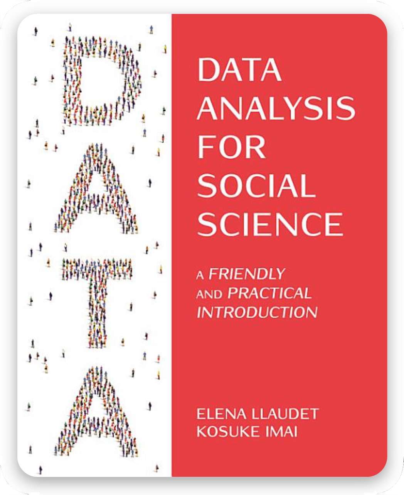

```{r setup, include=FALSE}
library(gradethis)
library(learnr)
tutorial_options(exercise.checker = gradethis::grade_learnr, 
                 exercise.reveal_solution = TRUE,
                 exercise.error.check.code = "grade_code()")
knitr::opts_chunk$set(echo = FALSE)
chapter_id <- "Chapter 4"
num_tutorial <- 95
```

<style>

.tutorial-question .panel-body { padding: 6px 15px; }

.tutorial-question-container {
  margin-bottom: 10px;
}

.borderexample {
 border-width:1px;
 border-style:solid;
 border-color:dodgerblue;
 padding: 10px;
}

/* make exercise hints easy to read */
.tutorial-hint-panel, .tutorial-hint-panel .panel-body, .tutorial-hint-panel .card-body, .tutorial-hint {
  color: #222222 !important;
  opacity: 1 !important;
  font-size: 15px;
}
</style>

<style>
table, td, th {
  border: 1px solid lightgray;
}

table {
  border-collapse: collapse;
  width: 100%;
  margin-bottom: 20px;
  margin-top: 15px;
}

td { text-align: center;}
th { text-align: center;}
th, td { padding: 15px; }
</style>


## <span style=color:white> OVERVIEW

<div style="overflow: auto;">

     
***What are these tutorials and how to use them?*** These tutorials are meant for students using DSS: <a href="https://ellaudet.github.io/dss_book/" style="color: inherit;">Llaudet and Imai's <i>Data Analysis for Social Science: A Friendly and Practical Introduction</i></a>.

They are designed to be completed *after* reading and performing the analyses explained in the book — they are meant to supplement, not replace, the book.
Each includes multiple-choice questions and hands-on coding exercises, with instant feedback so students can check their understanding on their own. At the end, students can generate a progress report of their work. The questions are organized into topics, 
each covering a handful of pages from the book that can be read in one sitting. Here is the recommended sequence:

<table>
  <tr>
    <th><span style=color:lightgray>$\blacktriangleright$ </span><span style=color:gray>  STEP 1  <span style=color:lightgray> $\blacktriangleright$ </span></th>
    <th><span style=color:lightgray> $\blacktriangleright$  </span><span style=color:gray>  STEP 2  <span style=color:lightgray> $\blacktriangleright$ </span></th>
    <th> <span style=color:lightgray> $\blacktriangleright$  </span><span style=color:gray>  STEP 3 <span style=color:lightgray> $\blacktriangleright$</span></th>
    <th> <span style=color:lightgray> $\blacktriangleright$  </span><span style=color:gray>  STEP 4 <span style=color:lightgray> $\blacktriangleright$</span></th>
  </tr>
  <tr>
<td> read the section(s) for a topic </td>
<td> perform the analyses on your computer </td>
<td> complete the review exercises </td>
<td> move on to the next topic </td>
  </tr>
</table>
</div>


***What does this particular tutorial cover?*** This is the tutorial for chapter 4, where we learn how to use linear regression to make predictions: how to fit a line that summarizes the relationship between a predictor (X) and an outcome variable (Y), how to use the fitted line to compute predicted outcomes ($\widehat{Y}$) and predicted changes in the outcome ($\triangle\widehat{Y}$), and how to measure how well the model fits the data with $R^2$. The review exercises for this chapter are organized into three topics:

<table>
  <tr>
    <th><span style=color:gray> Topic </span></th>
    <th><span style=color:gray> Readings </span></th>
    <th><span style=color:gray> Key Concepts and Notation </span></th>
    <th><span style=color:gray> R Functions and Operators </span></th>
  </tr>
  <tr>
    <td> Predicting Non-Binary Outcomes Using Linear Regression </td>
    <td> 4-4.4.1 and 4.6 </td>
    <td> predictor (X) vs. outcome variable (Y), prediction and correlation, observed ($Y$) vs. predicted outcomes ($\widehat{Y}$), prediction errors or residuals ($\widehat{\epsilon}$), the linear regression model, $\widehat{Y} = \widehat{\alpha} + \widehat{\beta}X$, interpretation of the intercept ($\widehat{\alpha}$) and the slope ($\widehat{\beta}$), $\triangle\widehat{Y} = \widehat{\beta}\triangle X$, the least squares method, extrapolation, $R^2$ (coefficient of determination), relationship between $R^2$ and correlation </td>
    <td> lm(Y ~ X), abline(), cor(), ^ </td>
  </tr>
  <tr>
    <td> Predicting Binary Outcomes Using Linear Regression </td>
    <td> TIPs on pp. 111-112 and 4.9 </td>
    <td> unit of measurement of $\widehat{\alpha}$, $\widehat{\beta}$, $\widehat{Y}$, and $\triangle\widehat{Y}$ when Y is binary, percentages vs. percentage points, $R^2$ when Y is binary, limitations of linear models with binary outcomes </td>
    <td> lm(Y ~ X), plot(), abline(), cor(), ^ </td>
  </tr>
  <tr>
    <td> Review </td>
    <td> 4-4.9 </td>
    <td> <span style=color:lightgray> (all of the above) </span> </td>
    <td> <span style=color:lightgray> (all of the above) </span> </td>
  </tr>
</table>

Let's start! <br>

## <span style=color:dodgerblue> 1. Predicting Non-Binary Outcomes Using Linear Regression
This topic focuses on <b>non-binary outcome variables</b>, like the ones in all the examples in the chapter, and on measuring how well the model fits the data with $R^2$. The review exercises in this topic cover:

<table>
  <tr>
    <th> Readings </th>
    <th> Key Concepts and Notation </th>
    <th> R Functions and Operators </th>
  </tr>
  <tr>
    <td> 4-4.4.1 and 4.6 </td>
    <td> predictor (X) vs. outcome variable (Y), prediction and correlation, observed ($Y$) vs. predicted outcomes ($\widehat{Y}$), prediction errors or residuals ($\widehat{\epsilon}$), the linear regression model, $\widehat{Y} = \widehat{\alpha} + \widehat{\beta}X$, interpretation of the intercept ($\widehat{\alpha}$) and the slope ($\widehat{\beta}$), $\triangle\widehat{Y} = \widehat{\beta}\triangle X$, the least squares method, extrapolation, $R^2$ (coefficient of determination), relationship between $R^2$ and correlation </td>
    <td> lm(Y ~ X), abline(), cor(), ^ </td>
  </tr>
</table>

## <font size="+2"> <span style=color:dodgerblue> $\textrm{             }$$\textrm{             }$$\textrm{             }$ Multiple-Choice Questions </span></font>

<div class="borderexample">
Instructions:
<ul style="padding-left: 0.3em; margin-left: 0; list-style-position: inside;">
  <li>Select correct answer(s) and click <i>Submit Answer</i></li>
  <li>If incorrect, click <i>Try Again</i> until correct</li>
  <li>Progress is saved automatically; click <i>Start Over</i> to delete all your answers</li>
</ul>
</div>

```{r ch4_topic1_mc}
qnum <- 0
quiz(caption=NULL,
question(paste0("<span style=color:dodgerblue> Q", qnum <- qnum+1, ":</span> Which of the three goals of quantitative social science research is chapter 4 about?"),
    answer("predicting a quantity of interest", correct = TRUE),
    answer("measuring a quantity of interest", message = "Chapter 3 is about measuring."),
    answer("explaining a quantity of interest", message = "Chapters 2 and 5 are about explaining."),
    post_message = "See DSS §1.1 and the introduction to chapter 4.",
    random_answer_order = TRUE,
    allow_retry = TRUE
),

question(paste0("<span style=color:dodgerblue> Q", qnum <- qnum+1, ":</span> When estimating causal effects, X is the treatment variable and Y is the outcome variable. When making predictions, X and Y are...?"),
    answer("X is the predictor and Y is the outcome variable", correct = TRUE),
    answer("X is the treatment variable and Y is the outcome variable", message = "When making predictions, X is not a treatment."),
    answer("X is the outcome variable and Y is the predictor", message = "It's the other way around."),
    answer("X is the outcome variable and Y is the treatment variable"),
    post_message = "X is the variable we use as the basis for our predictions; Y is the variable we are trying to predict.<br><br> See DSS §4.2.",
    random_answer_order = TRUE,
    allow_retry = TRUE
),

question(paste0("<span style=color:dodgerblue> Q", qnum <- qnum+1, ":</span> To be able to predict Y using X, X and Y need to be..."),
    answer("correlated, whether or not the relationship between them is causal", correct = TRUE),
    answer("causally related: changes in X must cause changes in Y", message = "Prediction does not require a causal relationship."),
    answer("causally related: changes in Y must cause changes in X", message = "Prediction does not require a causal relationship."),
    answer("measured in the same unit of measurement", message = "X and Y can be measured in different units."),
    post_message = "See DSS §4.2.",
    random_answer_order = TRUE,
    allow_retry = TRUE
),

question(paste0("<span style=color:dodgerblue> Q", qnum <- qnum+1, ":</span> When predicting a country's *gdp* using its *prior_gdp*..."),
    answer("*gdp* is the outcome variable (Y) and *prior_gdp* is the predictor (X)", correct = TRUE),
    answer("*prior_gdp* is the outcome variable (Y) and *gdp* is the predictor (X)", message = "We are predicting *gdp*."),
    answer("*gdp* is the outcome variable (Y) and *prior_gdp* is the treatment variable (X)", message = "When making predictions, X is the predictor."),
    answer("It does not matter which is which", message = "Swapping them would fit a different line."),
    post_message = "See DSS §4.2 and §4.4.",
    random_answer_order = TRUE,
    allow_retry = TRUE
),

question(paste0("<span style=color:dodgerblue> Q", qnum <- qnum+1, ":</span> When creating a scatter plot to make predictions, which variable goes on which axis?"),
    answer("The predictor goes on the x-axis and the outcome variable on the y-axis", correct = TRUE),
    answer("The outcome variable goes on the x-axis and the predictor on the y-axis", message = "It's the other way around."),
    answer("It does not matter", message = "It did not matter in chapter 3, but it does now."),
    post_message = "See DSS §4.4.1.",
    random_answer_order = TRUE,
    allow_retry = TRUE
),

question(paste0("<span style=color:dodgerblue> Q", qnum <- qnum+1, ":</span> In mathematical notation, what is the difference between $Y_i$ and $\\widehat{Y}_i$?"),
    answer("$Y_i$ is the observed outcome and $\\widehat{Y}_i$ is the predicted outcome for observation *i*", correct = TRUE),
    answer("$Y_i$ is the predicted outcome and $\\widehat{Y}_i$ is the observed outcome for observation *i*", message = "It's the other way around. The hat indicates an estimate."),
    answer("There is no difference; the hat is optional"),
    answer("$Y_i$ is the outcome and $\\widehat{Y}_i$ is the predictor for observation *i*", message = "The predictor is X."),
    post_message = "The hat indicates that the value is an estimate or approximation.<br><br> See DSS §4.3.1.",
    random_answer_order = TRUE,
    allow_retry = TRUE
),

question(paste0("<span style=color:dodgerblue> Q", qnum <- qnum+1, ":</span> The prediction error (or residual) for observation *i*, $\\widehat{\\epsilon}_i$, equals..."),
    answer("$Y_i - \\widehat{Y}_i$", correct = TRUE),
    answer("$\\widehat{Y}_i - Y_i$", message = "Check the order: observed minus predicted."),
    answer("$Y_i - X_i$", message = "A prediction error compares two versions of Y."),
    answer("$\\widehat{Y}_i - X_i$", message = "A prediction error compares two versions of Y."),
    post_message = "In a scatter plot, it is the vertical distance between the dot and the fitted line.<br><br> See DSS §4.3.1.",
    random_answer_order = TRUE,
    allow_retry = TRUE
),

question(paste0("<span style=color:dodgerblue> Q", qnum <- qnum+1, ":</span> The least squares method chooses the line of best fit by..."),
    answer("minimizing the sum of the squared residuals (SSR)", correct = TRUE),
    answer("maximizing the sum of the squared residuals (SSR)", message = "Note that the method is called *least* squares."),
    answer("minimizing the sum of the residuals", message = "Note that the method is called least *squares*."),
    answer("maximizing the correlation between X and Y", message = "The correlation between X and Y is what it is; the line does not change it."),
    post_message = "See DSS §4.3.4.",
    random_answer_order = TRUE,
    allow_retry = TRUE
),

question(paste0("<span style=color:dodgerblue> Q", qnum <- qnum+1, ":</span> Why does the least squares method square the residuals?"),
    answer("So that positive and negative prediction errors do not cancel each other out", correct = TRUE),
    answer("So that the prediction errors are measured in the same unit as X"),
    answer("So that the line goes through the point (0, 0)"),
    answer("Because R cannot handle negative numbers"),
    post_message = "See DSS §4.3.4.",
    random_answer_order = TRUE,
    allow_retry = TRUE
),

question(paste0("<span style=color:dodgerblue> Q", qnum <- qnum+1, ":</span> The function `lm()` fits a linear model (by default, using the least squares method to find the line of best fit). Its required argument is a formula of the type..."),
    answer("`Y ~ X`, where Y is the outcome variable and X is the predictor", correct = TRUE),
    answer("`X ~ Y`, where Y is the outcome variable and X is the predictor", message = "The outcome variable goes to the left of the `~`."),
    answer("`Y, X`, where Y is the outcome variable and X is the predictor", message = "`lm()` requires a formula, which uses the `~` character."),
    post_message = "See DSS §4.4.1.",
    random_answer_order = TRUE,
    allow_retry = TRUE
),

question(paste0("<span style=color:dodgerblue> Q", qnum <- qnum+1, ":</span> The predicted outcome $\\widehat{Y}$ produced by a fitted line is..."),
    answer("the average predicted value of Y for a particular value of X", correct = TRUE),
    answer("the exact value of Y for every observation with that value of X", message = "Observations with the same value of X can have different values of Y. $\\widehat{Y}$ is an average."),
    answer("the value of Y for the first observation in the dataset"),
    answer("the average value of X for a particular value of Y", message = "Check which variable we are predicting."),
    post_message = "This is why our predictions always end with the words 'on average'.<br><br> See DSS §4.3.1.",
    random_answer_order = TRUE,
    allow_retry = TRUE
),

question(paste0("<span style=color:dodgerblue> Q", qnum <- qnum+1, ":</span> The intercept coefficient, $\\widehat{\\alpha}$, is..."),
    answer("the $\\widehat{Y}$ when X = 0", correct = TRUE),
    answer("the $\\triangle\\widehat{Y}$ associated with $\\triangle X$ = 1", message = "That is the slope, $\\widehat{\\beta}$."),
    answer("the $\\widehat{Y}$ when X = 1", message = "Check the value of X."),
    answer("the $\\widehat{Y}$ at the point where the line crosses the y-axis", message = "Not necessarily: the y-axis is not always drawn at X = 0."),
    post_message = "See DSS §4.3.2.",
    random_answer_order = TRUE,
    allow_retry = TRUE
),

question(paste0("<span style=color:dodgerblue> Q", qnum <- qnum+1, ":</span> The slope coefficient, $\\widehat{\\beta}$, is..."),
    answer("the $\\triangle\\widehat{Y}$ associated with $\\triangle X$ = 1", correct = TRUE),
    answer("the $\\widehat{Y}$ when X = 0", message = "That is the intercept, $\\widehat{\\alpha}$."),
    answer("the $\\widehat{Y}$ when X = 1", message = "A *change* in $\\widehat{Y}$ goes with a *change* in X."),
    answer("the $\\triangle\\widehat{Y}$ when X = 1", message = "A *change* in $\\widehat{Y}$ goes with a *change* in X, not with a value of X."),
    post_message = "Graphically, it is rise over run between any two points on the line.<br><br> See DSS §4.3.3.",
    random_answer_order = TRUE,
    allow_retry = TRUE
),

question(paste0("<span style=color:dodgerblue> Q", qnum <- qnum+1, " - SELECT ALL THAT APPLY:</span> If $\\widehat{Y} = 5 - 2X$, then..."),
    answer("the intercept coefficient is 5", correct = TRUE),
    answer("the intercept coefficient is -2", message = "The intercept is the coefficient that does not accompany X."),
    answer("the slope coefficient is -2", correct = TRUE),
    answer("the slope coefficient is 2", message = "Check the sign."),
    answer("the slope coefficient is 5", message = "The slope is the coefficient that accompanies X."),
    answer("the correlation between X and Y is negative", correct = TRUE),
    answer("the correlation between X and Y is positive", message = "In a simple linear model, the slope and the correlation always have the same sign."),
    post_message = "See DSS §4.3.",
    random_answer_order = FALSE,
    allow_retry = TRUE
)
)
```

```{r scatter_A, echo=FALSE}
set.seed(1)
x1 <- runif(300, 0.5, 7.5)
y1 <- 10 + 5*x1 + rnorm(300, mean=0, sd=4)
plot(x1, y1,
     main = "",
     xlab = "",
     ylab = "",
     pch = 19,
     col = "steelblue",
     cex = 0.7, xlim=c(-1,9), ylim=c(0,60), xaxs = "i")
abline(a=10, b=5, lwd=2)
mtext("X", side = 1, line = 3, adj = 1)
mtext("Y", side = 2, line = 3, adj = 1, las=1)
abline(h=seq(0, 60, by=10), lty="dashed", col="gray")
abline(v=seq(-1, 9, by=1), lty="dashed", col="gray")
```

```{r ch4_topic1_mc_scatterA}
quiz(caption=NULL,
question(paste0("<span style=color:dodgerblue> Q", qnum <- qnum+1, ":</span> In the scatter plot above, what is the intercept coefficient, $\\widehat{\\alpha}$, of the fitted line?"),
    answer("10, because that is the $\\widehat{Y}$ when X = 0", correct = TRUE),
    answer("5, because that is the height of the line where it crosses the y-axis", message = "Look carefully: here, the y-axis is drawn at X = -1, not at X = 0."),
    answer("15, because that is the $\\widehat{Y}$ when X = 1", message = "The intercept is the $\\widehat{Y}$ when X = 0."),
    answer("It is impossible to know with the information given", message = "Find X = 0 on the x-axis, go up to the line, and read the height of that point."),
    post_message = "See DSS §4.3.2.",
    random_answer_order = TRUE,
    allow_retry = TRUE
),

question(paste0("<span style=color:dodgerblue> Q", qnum <- qnum+1, ":</span> In the same scatter plot, what is the slope coefficient, $\\widehat{\\beta}$, of the fitted line?"),
    answer("5, because rise over run equals 5", correct = TRUE),
    answer("10, because that is the $\\widehat{Y}$ when X = 0", message = "That is the intercept."),
    answer("0.2, because run over rise equals 0.2", message = "The slope is rise over run, not run over rise."),
    answer("It is impossible to know with the information given", message = "Pick two points on the line and compute rise over run."),
    post_message = "Using the points (0, 10) and (4, 30): (30 − 10)/(4 − 0) = 20/4 = 5.<br><br> See DSS §4.3.3.",
    random_answer_order = TRUE,
    allow_retry = TRUE
),

question(paste0("<span style=color:dodgerblue> Q", qnum <- qnum+1, ":</span> So, the formula of the fitted line in the scatter plot above is..."),
    answer("$\\widehat{Y} = 10 + 5X$", correct = TRUE),
    answer("$\\widehat{Y} = 5 + 10X$", message = "The intercept is the coefficient that does not accompany X."),
    answer("$\\widehat{Y} = 5 + 5X$", message = "Check the intercept: what is the $\\widehat{Y}$ when X = 0?"),
    answer("$\\widehat{Y} = 10 - 5X$", message = "Check the sign of the slope: the line tilts upward."),
    post_message = "See DSS §4.3.3 (pp. 105-106).",
    random_answer_order = TRUE,
    allow_retry = TRUE
),

question(paste0("<span style=color:dodgerblue> Q", qnum <- qnum+1, ":</span> There are two types of predictions we may be interested in: (1) the $\\widehat{Y}$ based on a value of X, and (2) the $\\triangle\\widehat{Y}$ associated with a $\\triangle X$. What formulas do we use for each?"),
    answer("(1) $\\widehat{Y} = \\widehat{\\alpha} + \\widehat{\\beta}X$ <br> (2) $\\triangle\\widehat{Y} = \\widehat{\\beta}\\triangle X$", correct = TRUE),
    answer("(1) $\\widehat{Y} = \\widehat{\\beta}X$ <br> (2) $\\triangle\\widehat{Y} = \\widehat{\\alpha} + \\widehat{\\beta}\\triangle X$", message = "Check which formula includes the intercept."),
    answer("(1) $\\widehat{Y} = \\widehat{\\alpha}$ <br> (2) $\\triangle\\widehat{Y} = \\widehat{\\beta}$", message = "These formulas are missing X and $\\triangle X$."),
    answer("Both use the same formula: $\\widehat{Y} = \\widehat{\\alpha} + \\widehat{\\beta}X$", message = "The intercept drops out when we predict a change."),
    post_message = "See DSS §4.4.1 (pp. 112-113).",
    random_answer_order = TRUE,
    allow_retry = TRUE
),

question(paste0("<span style=color:dodgerblue> Q", qnum <- qnum+1, ":</span> Consider this statement: 'Students who studied 10 hours are predicted to score 80 points on the exam, on average.' Is it describing a $\\widehat{Y}$ or a $\\triangle\\widehat{Y}$?"),
    answer("$\\widehat{Y}$: it predicts the value of Y for a value of X", correct = TRUE),
    answer("$\\triangle\\widehat{Y}$: it predicts the change in Y associated with a change in X", message = "Is the statement about a value of Y or about a change in Y?"),
    post_message = "See DSS §4.4.1 (pp. 112-113).",
    random_answer_order = TRUE,
    allow_retry = TRUE
),

question(paste0("<span style=color:dodgerblue> Q", qnum <- qnum+1, ":</span> Consider this statement: 'Studying 10 more hours is associated with a predicted increase in exam scores of 8 points, on average.' Is it describing a $\\widehat{Y}$ or a $\\triangle\\widehat{Y}$?"),
    answer("$\\triangle\\widehat{Y}$: it predicts the change in Y associated with a change in X", correct = TRUE),
    answer("$\\widehat{Y}$: it predicts the value of Y for a value of X", message = "Is the statement about a value of Y or about a change in Y?"),
    post_message = "See DSS §4.4.1 (pp. 112-113).",
    random_answer_order = TRUE,
    allow_retry = TRUE
    
),    
    

question(paste0("<span style=color:dodgerblue> Q", qnum <- qnum+1, ":</span> If $\\widehat{Y} = 10 + 5X$, what is the predicted value of Y when X = 3?"),
    answer("25, on average", correct = TRUE),
    answer("15, on average", message = "This is the $\\triangle\\widehat{Y}$ associated with $\\triangle X$ = 3. Here, we want the $\\widehat{Y}$ when X = 3."),
    answer("45, on average", message = "Multiplication comes before addition."),
    answer("3, on average", message = "That is the value of X."),
    post_message = "$\\widehat{Y}$ = 10 + 5×3 = 25.<br><br> See DSS §4.4.1.",
    random_answer_order = TRUE,
    allow_retry = TRUE
),

question(paste0("<span style=color:dodgerblue> Q", qnum <- qnum+1, ":</span> If $\\widehat{Y} = 10 + 5X$, what is the predicted change in Y associated with an increase in X of 3?"),
    answer("an increase of 15, on average", correct = TRUE),
    answer("an increase of 25, on average", message = "This is the $\\widehat{Y}$ when X = 3. Does the intercept play a role when predicting a *change*?"),
    answer("an increase of 45, on average", message = "Does the intercept play a role when predicting a *change*?"),
    answer("an increase of 5, on average", message = "That is the $\\triangle\\widehat{Y}$ associated with $\\triangle X$ = 1. Here, $\\triangle X$ = 3."),
    post_message = "$\\triangle\\widehat{Y}$ = 5×3 = 15.<br><br> See DSS §4.4.1.",
    random_answer_order = TRUE,
    allow_retry = TRUE
),

question(paste0("<span style=color:dodgerblue> Q", qnum <- qnum+1, ":</span> Suppose we fit the model $\\widehat{\\text{salary}} = 30{,}000 + 2{,}000 \\, \\text{experience}$, where *salary* is measured in dollars and *experience* in years. How should we interpret $\\widehat{\\alpha}$?"),
    answer("Employees with 0 years of experience are predicted to earn $30,000, on average", correct = TRUE),
    answer("An additional year of experience is associated with a predicted increase in salary of $30,000, on average", message = "That is how we would interpret a slope, and 30,000 is the intercept."),
    answer("Employees with 0 years of experience are predicted to earn $2,000, on average", message = "2,000 is the slope."),
    answer("The average salary among all employees is $30,000", message = "The intercept refers to X = 0, not to all observations."),
    post_message = "See DSS §4.4.1 (TIP on p. 111).",
    random_answer_order = TRUE,
    allow_retry = TRUE
),

question(paste0("<span style=color:dodgerblue> Q", qnum <- qnum+1, ":</span> In the same model, how should we interpret $\\widehat{\\beta}$?"),
    answer("An increase in experience of 1 year is associated with a predicted increase in salary of $2,000, on average", correct = TRUE),
    answer("Employees with 0 years of experience are predicted to earn $2,000, on average", message = "That is how we would interpret an intercept, and 2,000 is the slope."),
    answer("An increase in experience of 1 year causes salary to increase by $2,000, on average", message = "We should not use causal language when making predictions."),
    answer("An increase in experience of 1 year is associated with a predicted increase in salary of 2,000 percentage points, on average", message = "*salary* is non-binary and measured in dollars."),
    post_message = "See DSS §4.4.1 (TIP on p. 111).",
    random_answer_order = TRUE,
    allow_retry = TRUE
),

question(paste0("<span style=color:dodgerblue> Q", qnum <- qnum+1, ":</span> In the same model, what is the predicted salary of employees with 10 years of experience?"),
    answer("$50,000, on average", correct = TRUE),
    answer("$20,000, on average", message = "This is the $\\triangle\\widehat{Y}$ associated with $\\triangle X$ = 10. Here, we want the $\\widehat{Y}$ when X = 10."),
    answer("$320,000, on average", message = "Multiplication comes before addition."),
    answer("$32,000, on average", message = "Check your calculations: 30,000 + 2,000×10."),
    post_message = "$\\widehat{\\text{salary}}$ = 30,000 + 2,000×10 = 50,000.<br><br> See DSS §4.4.1.",
    random_answer_order = TRUE,
    allow_retry = TRUE
),

question(paste0("<span style=color:dodgerblue> Q", qnum <- qnum+1, ":</span> In the same model, what is the predicted change in salary associated with an increase in experience of 10 years?"),
    answer("an increase of $20,000, on average", correct = TRUE),
    answer("an increase of $50,000, on average", message = "This is the $\\widehat{Y}$ when X = 10. Does the intercept play a role when predicting a *change*?"),
    answer("an increase of $2,000, on average", message = "That is the $\\triangle\\widehat{Y}$ associated with $\\triangle X$ = 1. Here, $\\triangle X$ = 10."),
    answer("an increase of $32,000, on average", message = "Does the intercept play a role when predicting a *change*?"),
    post_message = "$\\triangle\\widehat{\\text{salary}}$ = 2,000×10 = 20,000.<br><br> See DSS §4.4.1.",
    random_answer_order = TRUE,
    allow_retry = TRUE
),

question(paste0("<span style=color:dodgerblue> Q", qnum <- qnum+1, ":</span> Which of the following uses the appropriate language for a *prediction*?"),
    answer("An increase in experience of 1 year is associated with a predicted increase in salary of $2,000, on average", correct = TRUE),
    answer("An increase in experience of 1 year increases salary by $2,000, on average", message = "This is causal language, which we use when estimating causal effects."),
    answer("An increase in experience of 1 year is associated with an increase in salary of $2,000", message = "This statement is missing the words 'predicted' and 'on average'."),
    answer("An increase in experience of 1 year explains an increase in salary of $2,000, on average", message = "'Explains' suggests a causal claim."),
    post_message = "See DSS §4.2 and §4.4.1.",
    random_answer_order = TRUE,
    allow_retry = TRUE
)
)
```

<br><b>Now let's turn to measuring how well a model fits the data.</b>

```{r ch4_topic1_mc_r2}
quiz(caption=NULL,
question(paste0("<span style=color:dodgerblue> Q", qnum <- qnum+1, ":</span> What does an $R^2$ of 0.8 mean?"),
    answer("The model explains 80% of the variation of Y", correct = TRUE),
    answer("The model predicts 80% of the observations correctly", message = "$R^2$ is about the variation of Y explained."),
    answer("The correlation between X and Y is 0.8", message = "In the simple linear model, $R^2$ is the correlation *squared*."),
    answer("The model explains 0.8% of the variation of Y", message = "Remember to multiply by 100."),
    post_message = "0.8×100 = 80%.<br><br> See DSS §4.6.",
    random_answer_order = TRUE,
    allow_retry = TRUE
),

question(paste0("<span style=color:dodgerblue> Q", qnum <- qnum+1, ":</span> In the simple linear model (a model with only one X), $R^2$ is equal to..."),
    answer("the correlation between X and Y, squared", correct = TRUE),
    answer("the correlation between X and Y", message = "Check the exponent."),
    answer("the slope coefficient, squared"),
    answer("1 minus the correlation between X and Y", message = "Check the formula."),
    post_message = "$R^2$ = cor(X, Y)².<br><br> See DSS §4.6.",
    random_answer_order = TRUE,
    allow_retry = TRUE
),

question(paste0("<span style=color:dodgerblue> Q", qnum <- qnum+1, ":</span> If cor(X, Y) = −0.5, then the linear model predicting Y using X explains..."),
    answer("25% of the variation of Y", correct = TRUE),
    answer("−25% of the variation of Y", message = "A squared number cannot be negative."),
    answer("50% of the variation of Y", message = "Remember to square the correlation."),
    answer("−50% of the variation of Y", message = "Remember to square the correlation."),
    post_message = "$R^2$ = (−0.5)² = 0.25, and 0.25×100 = 25%.<br><br> See DSS §4.6.",
    random_answer_order = TRUE,
    allow_retry = TRUE
),

question(paste0("<span style=color:dodgerblue> Q", qnum <- qnum+1, " - SELECT ALL THAT APPLY:</span> Which of the following statements about $R^2$ are true?"),
    answer("It ranges from 0 to 1", correct = TRUE),
    answer("The higher it is, the better the model fits the data", correct = TRUE),
    answer("We should only compare $R^2$s between models with the same outcome variable", correct = TRUE),
    answer("A high $R^2$ means that X causes Y", message = "$R^2$ says nothing about causation."),
    answer("For a given outcome variable, the higher it is, the smaller the prediction errors tend to be", correct = TRUE),
    answer("It can be negative when X and Y are negatively correlated", message = "A squared number cannot be negative."),
    post_message = "See DSS §4.6.",
    random_answer_order = TRUE,
    allow_retry = TRUE
),

question(paste0("<span style=color:dodgerblue> Q", qnum <- qnum+1, ":</span> Does an $R^2$ of 0.21 necessarily mean that a model is bad at predicting Y?"),
    answer("Not necessarily. Some outcomes are intrinsically harder to predict than others", correct = TRUE),
    answer("Yes. An $R^2$ of 0.21 always indicates a bad model", message = "Some outcomes are intrinsically harder to predict than others."),
    answer("No. An $R^2$ of 0.21 always indicates an excellent model", message = "It means that the model explains 21% of the variation of Y."),
    post_message = "See DSS §4.6.1.",
    random_answer_order = TRUE,
    allow_retry = TRUE
),

question(paste0("<span style=color:dodgerblue> Q", qnum <- qnum+1, ":</span> When looking for a variable to use as a predictor, we look for a variable that is..."),
    answer("highly correlated with Y (in absolute terms)", correct = TRUE),
    answer("weakly correlated with Y", message = "The weaker the correlation, the lower the $R^2$."),
    answer("positively correlated with Y", message = "The sign does not matter; the strength does."),
    answer("causally related to Y", message = "Prediction does not require a causal relationship."),
    post_message = "See DSS §4.6.",
    random_answer_order = TRUE,
    allow_retry = TRUE
),

question(paste0("<span style=color:dodgerblue> Q", qnum <- qnum+1, ":</span> Model A predicts Y using $X_1$, where cor($X_1$, Y) = 0.35. Model B predicts the same Y using $X_2$, where cor($X_2$, Y) = −0.85. Which model fits the data better?"),
    answer("Model B, because the absolute value of its correlation is larger", correct = TRUE),
    answer("Model A, because its correlation is positive", message = "The sign tells us the direction of the association, not how well the model fits."),
    answer("We cannot compare them because they use different predictors", message = "We can compare them: they have the same outcome variable."),
    post_message = "$R^2_A$ = 0.35² ≈ 0.12 and $R^2_B$ = (−0.85)² ≈ 0.72.<br><br> See DSS §4.6.",
    random_answer_order = TRUE,
    allow_retry = TRUE
)
)
```


## <font size="+2"> <span style=color:dodgerblue> $\textrm{             }$$\textrm{             }$$\textrm{             }$ Coding Exercises </span></font>

<div class="borderexample">
Instructions:
<ul style="padding-left: 0.3em; margin-left: 0; list-style-position: inside;">
<li>Type code in the <i>R code</i> window</li>
  <li>Click <i>Run Code</i> to see the output</li>
  <li>Click <i>Submit Answer</i> when satisfied</li>
  <li>If incorrect, modify your code and try again until correct</li>
  <li>Click <i>Hint</i> as needed</li>
  <li>Progress is saved automatically; click <i>Start Over</i> to delete all your answers</li>
</ul>
</div>

<br><b>For the next few questions, we work with the countries dataset, where the unit of observation is countries and the variables are as described below:</b>

<table>
  <tr>
    <th> variable </th>
    <th> description </th>
  </tr>
  <tr>
    <td> *country* </td>
    <td> name of the country </td>
  </tr>
  <tr>
    <td>*gdp* </td>
    <td> country's GDP from 2005 to 2006 (in trillions of local currency units) </td>
  </tr>
  <tr>
    <td> *prior_gdp* </td>
    <td> country's GDP from 1992 to 1993 (in trillions of local currency units) </td>
  </tr>
  <tr>
    <td>*light* </td>
    <td> country's average night-time light emissions from 2005 to 2006 (on a scale from 0 to 63) </td>
  </tr>
  <tr>
    <td>*prior_light* </td>
    <td> country's average night-time light emissions from 1992 to 1993 (on a scale from 0 to 63) </td>
  </tr>
</table>

```{r co, echo=FALSE}
co <- read.csv("data/countries.csv")
```

<span style=color:dodgerblue> **SETUP:**</span> **Suppose we have already set the working directory to the DSS folder and run the code below to (1) read and store the countries dataset in an object called `co` and (2) show the first six observations.**

```{r co_FALSE, eval=FALSE, echo=TRUE}
co <- read.csv("countries.csv") # reads and stores data
```

```{r co_render, include=FALSE}
co <- read.csv("data/countries.csv")
```

```{r co_head, echo=TRUE}
head(co) # shows the first six observations
```

<br> <span style=color:dodgerblue> **Q`r qnum <- qnum + 1; qnum`:** </span> **Use `lm()` to fit a linear model to predict *gdp* using *prior_gdp*.**

```{r ch4_topic1_r1, exercise=TRUE, exercise.setup = "co"}

```

<div id="ch4_topic1_r1-hint">
Hint: Use `lm()` with a formula of the type `Y ~ X`, and use either the `data` argument or the `$` character to identify where the variables are stored. See DSS §4.4.1.
</div>

```{r ch4_topic1_r1-solution}
lm(gdp ~ prior_gdp, data = co)
```

```{r ch4_topic1_r1-check}
grade_this({
  if (!inherits(.result, "lm")) {
    fail("Use `lm()` to fit the linear model. See DSS §4.4.1.")
  }
  if (isTRUE(all.equal(unname(coef(.result)), unname(coef(.solution))))) {
    pass("<br><br> See DSS §4.4.1.")
  }
  fail("Check the formula: the outcome variable goes to the left of the `~` and the predictor to its right. See DSS §4.4.1.")
})
```

```{r ch4_topic1_r1_inter}
quiz(caption=NULL,
question(paste0("<span style=color:dodgerblue> Q", qnum <- qnum+1, ":</span> Based on the output above, the fitted line is..."),
    answer("$\\widehat{\\text{gdp}} = 0.72 + 1.61 \\, \\text{prior_gdp}$", correct = TRUE),
    answer("$\\widehat{\\text{gdp}} = 1.61 + 0.72 \\, \\text{prior_gdp}$", message = "R shows $\\widehat{\\alpha}$ under (Intercept) and $\\widehat{\\beta}$ under the name of the predictor."),
    answer("$\\widehat{\\text{prior_gdp}} = 0.72 + 1.61 \\, \\text{gdp}$", message = "Which variable are we predicting?"),
    answer("$\\widehat{\\text{gdp}} = 0.72 - 1.61 \\, \\text{prior_gdp}$", message = "Check the sign of the slope."),
    post_message = "See DSS §4.4.1.",
    random_answer_order = TRUE,
    allow_retry = TRUE
),

question(paste0("<span style=color:dodgerblue> Q", qnum <- qnum+1, ":</span> Based on the fitted line, what is the predicted GDP of a country whose prior GDP was 100 trillion local currency units?"),
    answer("about 161.72 trillion local currency units, on average", correct = TRUE),
    answer("about 161 trillion local currency units, on average", message = "This is the $\\triangle\\widehat{Y}$ associated with $\\triangle X$ = 100. Here, we want the $\\widehat{Y}$ when X = 100."),
    answer("about 233 trillion local currency units, on average", message = "Multiplication comes before addition."),
    answer("about 2.33 trillion local currency units, on average", message = "Check your calculations: 0.72 + 1.61×100."),
    post_message = "$\\widehat{\\text{gdp}}$ = 0.72 + 1.61×100 = 161.72.<br><br> See DSS §4.4.1 (p. 112).",
    random_answer_order = TRUE,
    allow_retry = TRUE
),

question(paste0("<span style=color:dodgerblue> Q", qnum <- qnum+1, ":</span> Based on the fitted line, what is the predicted change in GDP associated with an increase in prior GDP of 100 trillion local currency units?"),
    answer("an increase of about 161 trillion local currency units, on average", correct = TRUE),
    answer("an increase of about 161.72 trillion local currency units, on average", message = "This is the $\\widehat{Y}$ when X = 100. Does the intercept play a role when predicting a *change*?"),
    answer("an increase of about 1.61 trillion local currency units, on average", message = "That is the $\\triangle\\widehat{Y}$ associated with $\\triangle X$ = 1. Here, $\\triangle X$ = 100."),
    answer("an increase of about 100 trillion local currency units, on average", message = "That is the change in X."),
    post_message = "$\\triangle\\widehat{\\text{gdp}}$ = 1.61×100 = 161.<br><br> See DSS §4.4.1 (pp. 112-113).",
    random_answer_order = TRUE,
    allow_retry = TRUE
),

question(paste0("<span style=color:dodgerblue> Q", qnum <- qnum+1, ":</span> Which is the best way to state the prediction above?"),
    answer("An increase in prior GDP of 100 trillion local currency units is associated with a predicted increase in GDP of about 161 trillion local currency units, on average", correct = TRUE),
    answer("An increase in prior GDP of 100 trillion local currency units increases GDP by about 161 trillion local currency units, on average", message = "This is causal language."),
    answer("An increase in prior GDP of 100 trillion local currency units is associated with a predicted GDP of about 161 trillion local currency units, on average", message = "This describes a predicted value, not a predicted change."),
    answer("An increase in prior GDP of 100 trillion local currency units is associated with a predicted increase in GDP of about 161 trillion local currency units", message = "This statement is missing the words 'on average'."),
    post_message = "See DSS §4.4.1 (pp. 111-113).",
    random_answer_order = TRUE,
    allow_retry = TRUE
)
)
```

<br> <span style=color:dodgerblue> **Q`r qnum <- qnum + 1; qnum`:** </span> **Create the scatter plot of *prior_gdp* and *gdp*. Then, fit the linear model that predicts *gdp* using *prior_gdp*, store its output in an object called `fit`, and use `fit` as the main argument of `abline()` to add the fitted line to the scatter plot.**

```{r ch4_topic1_r2, exercise=TRUE, exercise.setup = "co"}

```

<div id="ch4_topic1_r2-hint">
Hint: First, create the scatter plot with `plot()`. Then, run `fit <- lm(...)`, and finally run `abline(fit)`. See DSS §4.4.1.
</div>

```{r ch4_topic1_r2-solution}
plot(x = co$prior_gdp, y = co$gdp)
fit <- lm(gdp ~ prior_gdp, data = co)
abline(fit)
```

```{r ch4_topic1_r2-check}
grade_this({
  code <- gsub("\\s", "", paste(.user_code, collapse = ""))
  ok_plot <- grepl("plot\\((x=)?co\\$prior_gdp,(y=)?co\\$gdp[,)]|plot\\(y=co\\$gdp,x=co\\$prior_gdp[,)]", code)
  ok_line <- grepl("abline\\(", code) && grepl("lm\\((formula=)?(co\\$)?gdp~(co\\$)?prior_gdp", code)
  if (!ok_plot) {
    fail("Check the scatter plot: the predictor goes on the x-axis and the outcome variable on the y-axis. See DSS §4.4.1.")
  }
  if (!ok_line) {
    fail("Now add the fitted line: store the output of `lm()` in an object and use it as the argument of `abline()`. See DSS §4.4.1.")
  }
  pass("<br><br> See DSS §4.4.1.")
})
```

```{r ch4_topic1_r2_inter}
quiz(caption=NULL,
question(paste0("<span style=color:dodgerblue> Q", qnum <- qnum+1, " - SELECT ALL THAT APPLY:</span> Looking at the scatter plot, we can see that..."),
    answer("the linear association between *prior_gdp* and *gdp* is positive", correct = TRUE),
    answer("the linear association between *prior_gdp* and *gdp* is negative", message = "Check the direction of the dots."),
    answer("the linear association between *prior_gdp* and *gdp* is weak", message = "Check how close the dots are to the line."),
    answer("the linear association between *prior_gdp* and *gdp* is strong", correct = TRUE),
    answer("a country's prior GDP causes its GDP", message = "This is not something we can see in a scatter plot."),
    post_message = "See DSS §3.5.1 and §4.4.1.",
    random_answer_order = FALSE,
    allow_retry = TRUE
)
)
```

<br> <span style=color:dodgerblue> **Q`r qnum <- qnum + 1; qnum`:** </span> **Compute the $R^2$ of the linear model that predicts *gdp* using *prior_gdp*.**

```{r ch4_topic1_r3, exercise=TRUE, exercise.setup = "co"}

```

<div id="ch4_topic1_r3-hint">
Hint: In the simple linear model, $R^2$ is the correlation between X and Y squared. Use `cor()` and the `^` operator. See DSS §4.6.1.
</div>

```{r ch4_topic1_r3-solution}
cor(co$gdp, co$prior_gdp)^2
```

```{r ch4_topic1_r3-check}
grade_this({
  if (is.numeric(.result) && length(.result) == 1 && isTRUE(all.equal(.result, .solution))) {
    pass("<br><br> See DSS §4.6.1.")
  }
  if (is.numeric(.result) && length(.result) == 1 && isTRUE(all.equal(.result^2, .solution))) {
    fail("This is the correlation. Now square it using `^2`. See DSS §4.6.1.")
  }
  fail("Use `cor()` on the two variables and square the result with `^2`. See DSS §4.6.1.")
})
```

```{r ch4_topic1_r3_inter}
quiz(caption=NULL,
question(paste0("<span style=color:dodgerblue> Q", qnum <- qnum+1, ":</span> This means that the linear model that uses prior GDP as a predictor explains about..."),
    answer("98% of the variation of GDP", correct = TRUE),
    answer("98% of the variation of prior GDP", message = "The model explains the variation of Y, the outcome variable."),
    answer("2% of the variation of GDP", message = "That is the proportion *not* explained."),
    answer("0.98% of the variation of GDP", message = "Remember to multiply by 100."),
    post_message = "See DSS §4.6.1.",
    random_answer_order = TRUE,
    allow_retry = TRUE
),

question(paste0("<span style=color:dodgerblue> Q", qnum <- qnum+1, ":</span> Does this $R^2$ mean that the model predicts GDP correctly 98% of the time?"),
    answer("No. It means that the model explains 98% of the variation in GDP; the remaining 2% is left unexplained", correct = TRUE),
    answer("Yes. $R^2$ is the proportion of observations the model predicts correctly", message = "$R^2$ is about the variation of Y explained, not about counting correct predictions."),
    post_message = "See DSS §4.6.",
    random_answer_order = TRUE,
    allow_retry = TRUE
)
)
```

## <span style=color:dodgerblue> 2. Predicting Binary Outcomes Using Linear Regression
This topic focuses on <b>binary outcome variables</b>. Although the chapter does not include an example with a binary outcome variable, binary outcomes are very common in the social sciences (we will analyze one in chapter 5), and interpreting the results requires extra care (see the TIPs on pp. 111-112 and the cheatsheet in §4.9.1). The review exercises in this topic cover:

<table>
  <tr>
    <th> Readings </th>
    <th> Key Concepts and Notation </th>
    <th> R Functions and Operators </th>
  </tr>
  <tr>
    <td> TIPs on pp. 111-112 and 4.9 </td>
    <td> unit of measurement of $\widehat{\alpha}$, $\widehat{\beta}$, $\widehat{Y}$, and $\triangle\widehat{Y}$ when Y is binary, percentages vs. percentage points, $R^2$ when Y is binary, limitations of linear models with binary outcomes </td>
    <td> lm(Y ~ X), plot(), abline(), cor(), ^ </td>
  </tr>
</table>


## <font size="+2"> <span style=color:dodgerblue> $\textrm{             }$$\textrm{             }$$\textrm{             }$ Multiple-Choice Questions </span></font>

<div class="borderexample">
Instructions:
<ul style="padding-left: 0.3em; margin-left: 0; list-style-position: inside;">
  <li>Select correct answer(s) and click <i>Submit Answer</i></li>
  <li>If incorrect, click <i>Try Again</i> until correct</li>
  <li>Progress is saved automatically; click <i>Start Over</i> to delete all your answers</li>
</ul>
</div>

```{r ch4_topic2_mc}
quiz(caption=NULL,

question(paste0("<span style=color:dodgerblue> Q", qnum <- qnum+1, ":</span> Let's start by reminding ourselves how to interpret means. Suppose a dataset on mayors has two variables: *reelected* (1 = was reelected, 0 = was not) and *age* (in years). If $\\overline{\\text{reelected}}$ = 0.64 and $\\overline{\\text{age}}$ = 52, this means that..."),
    answer("64% of mayors were reelected, and mayors are 52 years old, on average", correct = TRUE),
    answer("on average, 64% of mayors were reelected, and mayors are 52 years old, on average", message = "The mean of a binary variable is a proportion, so we do not use 'on average' when interpreting it."),
    answer("0.64 mayors were reelected, and mayors are 52 years old, on average", message = "Is *reelected* binary or non-binary?"),
    answer("64% of mayors were reelected, and 52% of mayors are older than average", message = "Is *age* binary or non-binary?"),
    post_message = "See DSS §1.8.2.",
    random_answer_order = TRUE,
    allow_retry = TRUE
),

question(paste0("<span style=color:dodgerblue> Q", qnum <- qnum+1, ":</span> Since $\\widehat{Y}$ is an average predicted value of Y, if Y is binary, $\\widehat{Y}$ can be interpreted as..."),
    answer("the predicted proportion of observations for which Y equals 1, or the predicted probability that Y equals 1", correct = TRUE),
    answer("the predicted number of observations for which Y equals 1", message = "The mean of a binary variable is a proportion, not a count."),
    answer("the predicted value of X", message = "We are predicting Y, not X."),
    post_message = "See DSS §1.8.2 and §4.3.1.",
    random_answer_order = TRUE,
    allow_retry = TRUE
),

question(paste0("<span style=color:dodgerblue> Q", qnum <- qnum+1, ":</span> If Y is binary, in what unit of measurement are $\\widehat{\\alpha}$ and $\\widehat{Y}$?"),
    answer("In percentages (after multiplying by 100)", correct = TRUE),
    answer("In percentage points (after multiplying by 100)", message = "Percentage points are for changes."),
    answer("In the same unit of measurement as Y", message = "This is the case only when Y is non-binary."),
    answer("In the same unit of measurement as X", message = "We are predicting Y, so our predictions never take the unit of X."),
    post_message = "Both are predicted *values* of Y, and the mean of a binary variable is a proportion.<br><br> See DSS §4.4.1 (TIPs on pp. 111-112) and §4.9.1.",
    random_answer_order = TRUE,
    allow_retry = TRUE
),

question(paste0("<span style=color:dodgerblue> Q", qnum <- qnum+1, ":</span> If Y is binary, in what unit of measurement are $\\widehat{\\beta}$ and $\\triangle\\widehat{Y}$?"),
    answer("In percentage points (after multiplying by 100)", correct = TRUE),
    answer("In percentages (after multiplying by 100)", message = "Both are *changes* in a proportion. Recall: % − % = p.p."),
    answer("In the same unit of measurement as Y", message = "This is the case only when Y is non-binary."),
    answer("In the same unit of measurement as X", message = "We are predicting Y, so our predictions never take the unit of X."),
    post_message = "Both are predicted *changes* in Y, and the change in a proportion is measured in percentage points.<br><br> See DSS §4.4.1 (TIPs on pp. 111-112) and §4.9.1.",
    random_answer_order = TRUE,
    allow_retry = TRUE
),

question(paste0("<span style=color:dodgerblue> Q", qnum <- qnum+1, " - SELECT ALL THAT APPLY:</span> If the predicted probability of voting goes from 40% to 50%, it increased by..."),
    answer("10 percentage points", correct = TRUE),
    answer("25 percent", correct = TRUE),
    answer("10 percent", message = "An increase of 10 percent from 40% would result in 44%."),
    answer("25 percentage points", message = "An increase of 25 percentage points from 40% would result in 65%."),
    post_message = "50% − 40% = 10 p.p.; (50 − 40)/40 × 100 = 25%.<br><br> See DSS §2.5.3 (TIP on p. 44) and §4.5 (TIP on p. 117).",
    random_answer_order = TRUE,
    allow_retry = TRUE
),

question(paste0("<span style=color:dodgerblue> Q", qnum <- qnum+1, ":</span> Suppose we fit the model $\\widehat{\\text{employed}} = 0.45 + 0.008 \\, \\text{education}$, where *employed* is binary (1 = employed, 0 = not employed) and *education* is measured in years. How should we interpret $\\widehat{\\alpha}$?"),
    answer("Among individuals with 0 years of education, the predicted probability of being employed is 45%, on average", correct = TRUE),
    answer("Among individuals with 0 years of education, the predicted probability of being employed is 45 percentage points, on average", message = "$\\widehat{\\alpha}$ is a predicted value, not a change."),
    answer("Among individuals with 0 years of education, the predicted probability of being employed is 0.45%, on average", message = "Remember to multiply by 100."),
    answer("An increase in education of 1 year is associated with a predicted increase in the probability of being employed of 45 percentage points, on average", message = "That is how we would interpret a slope, and 0.45 is the intercept."),
    post_message = "0.45×100 = 45%.<br><br> See DSS §4.4.1 (TIP on p. 111).",
    random_answer_order = TRUE,
    allow_retry = TRUE
),

question(paste0("<span style=color:dodgerblue> Q", qnum <- qnum+1, ":</span> In the same model, how should we interpret $\\widehat{\\beta}$?"),
    answer("An increase in education of 1 year is associated with a predicted increase in the probability of being employed of 0.8 percentage points, on average", correct = TRUE),
    answer("An increase in education of 1 year increases the probability of being employed by 0.8 percentage points, on average", message = "We should not use causal language when making predictions."),
    answer("An increase in education of 1 year is associated with a predicted increase in the probability of being employed of 0.8%, on average", message = "$\\widehat{\\beta}$ is a change in a proportion."),
    answer("An increase in education of 1 year is associated with a predicted increase in the probability of being employed of 8 percentage points, on average", message = "Check your calculations: 0.008×100."),
    answer("An increase in education of 1 year is associated with a predicted increase in the probability of being employed of 0.008 percentage points, on average", message = "Remember to multiply by 100."),
    post_message = "0.008×100 = 0.8 p.p.<br><br> See DSS §4.4.1 (TIP on p. 111).",
    random_answer_order = TRUE,
    allow_retry = TRUE
),

question(paste0("<span style=color:dodgerblue> Q", qnum <- qnum+1, ":</span> In the same model, what is the predicted probability of being employed among individuals with 12 years of education?"),
    answer("about 55%, on average", correct = TRUE),
    answer("about 10 percentage points, on average", message = "This is the $\\triangle\\widehat{Y}$ associated with $\\triangle X$ = 12, and it is not what we want here."),
    answer("about 55 percentage points, on average", message = "This is a predicted value, not a change."),
    answer("about 0.55%, on average", message = "Remember to multiply by 100."),
    post_message = "$\\widehat{\\text{employed}}$ = 0.45 + 0.008×12 = 0.546, and 0.546×100 ≈ 55%.<br><br> See DSS §4.4.1 (TIP on p. 112).",
    random_answer_order = TRUE,
    allow_retry = TRUE
),

question(paste0("<span style=color:dodgerblue> Q", qnum <- qnum+1, ":</span> In the same model, what is the predicted change in the probability of being employed associated with an increase in education of 4 years?"),
    answer("an increase of about 3.2 percentage points, on average", correct = TRUE),
    answer("an increase of about 3.2%, on average", message = "This is a change in a proportion."),
    answer("an increase of about 48 percentage points, on average", message = "Does the intercept play a role when predicting a *change*?"),
    answer("an increase of about 0.032 percentage points, on average", message = "Remember to multiply by 100."),
    post_message = "$\\triangle\\widehat{\\text{employed}}$ = 0.008×4 = 0.032, and 0.032×100 = 3.2 p.p.<br><br> See DSS §4.4.1 (TIP on p. 112).",
    random_answer_order = TRUE,
    allow_retry = TRUE
)
)
```

<br><b>Finally, let's look at one of the limitations of using a linear model to predict a binary outcome. In the scatter plot below, Y is binary (all dots are at 0 or 1), the solid line is the fitted linear model, and the dashed curve is an S-shaped model.</b>

```{r binary_limit, echo=FALSE}
set.seed(4)
x4 <- runif(200, 40, 100)
y4 <- rbinom(200, 1, pnorm((x4 - 75) / 8))
fit4 <- lm(y4 ~ x4)
plot(x4, y4, xlim = c(20, 120), ylim = c(-0.8, 1.8),
     main = "", xlab = "", ylab = "", pch = 19,
     col = adjustcolor("steelblue", alpha.f = 0.4), las = 1)
abline(h = c(0, 1), lty = 3, col = "gray")
abline(fit4, lwd = 2, col = "gray60")
curve(pnorm((x - 75) / 8), from = 20, to = 120, add = TRUE, lty = 2, lwd = 2, col = "gray60")
mtext("X", side = 1, line = 3, adj = 1)
mtext("Y", side = 2, line = 3, adj = 1, las = 1)
```

```{r ch4_topic2_binary_limit}
quiz(caption=NULL,
question(paste0("<span style=color:dodgerblue> Q", qnum <- qnum+1, " - SELECT ALL THAT APPLY:</span> Looking at the scatter plot above, which of the following statements are true?"),
    answer("For some values of X, the fitted linear model predicts probabilities below 0% and above 100%, which are nonsensical", correct = TRUE),
    answer("The probability that Y equals 1 does not increase at a constant rate as X increases: it levels off near 0% and near 100%", correct = TRUE),
    answer("An S-shaped model, such as probit, would fit these data better and ensure that all predictions fall between 0% and 100%", correct = TRUE),
    answer("A linear model cannot be fitted when Y is binary", message = "We can fit it with `lm()`; the problem is the predictions it can produce."),
    post_message = "This is one of the limitations of using linear models to predict binary outcomes. (S-shaped models such as probit are beyond the scope of this book.)",
    random_answer_order = TRUE,
    allow_retry = TRUE
)
)
```

## <font size="+2"> <span style=color:dodgerblue> $\textrm{             }$$\textrm{             }$$\textrm{             }$ Coding Exercises </span></font>

<div class="borderexample">
Instructions:
<ul style="padding-left: 0.3em; margin-left: 0; list-style-position: inside;">
<li>Type code in the <i>R code</i> window</li>
  <li>Click <i>Run Code</i> to see the output</li>
  <li>Click <i>Submit Answer</i> when satisfied</li>
  <li>If incorrect, modify your code and try again until correct</li>
  <li>Click <i>Hint</i> as needed</li>
  <li>Progress is saved automatically; click <i>Start Over</i> to delete all your answers</li>
</ul>
</div>


<br><b>For the next few questions, we work with the BES survey data from chapter 3, where the unit of observation is survey respondents and the variables are as described below:</b>

<table>
  <tr>
    <th> variable </th>
    <th> description </th>
  </tr>
  <tr>
    <td> *vote* </td>
    <td> respondent's vote intention in the EU referendum: "leave", "stay", "don't know", or "won't vote" </td>
  </tr>
  <tr>
    <td>*leave* </td>
    <td> identifies leave voters: 1 = intends to vote "leave" or 0 = intends to vote "stay"; <br>NA = either "don't know" or "won't vote" </td>
  </tr>
  <tr>
    <td> *education* </td>
    <td> respondent's highest educational qualification: 1 = no qualifications, 2 = GCSE, 3 = GCE A level, <br>4 = undergraduate degree, 5 = postgraduate degree; NA = no answer </td>
  </tr>
  <tr>
    <td>*age* </td>
    <td> respondent's age in years </td>
  </tr>
</table>

```{r bes, echo=FALSE}
bes <- read.csv("data/BES.csv")
bes1 <- na.omit(bes)
```

<span style=color:dodgerblue> **SETUP:**</span> **Suppose we have already set the working directory to the DSS folder and run the code below to (1) read and store the BES dataset in an object called `bes`, (2) remove the observations with missing values and store the new dataframe in an object called `bes1`, and (3) show the first six observations of `bes1`.**

```{r bes_FALSE, eval=FALSE, echo=TRUE}
bes <- read.csv("BES.csv") # reads and stores data
bes1 <- na.omit(bes) # removes observations with NAs and stores new dataframe
```

```{r bes_render, include=FALSE}
bes <- read.csv("data/BES.csv")
bes1 <- na.omit(bes)
```

```{r bes_head, echo=TRUE}
head(bes1) # shows the first six observations
```

<br> <span style=color:dodgerblue> **Q`r qnum <- qnum + 1; qnum`:** </span> **Use `lm()` to fit a linear model to predict *leave* using *age* (use `bes1`).**

```{r ch4_topic2_r1, exercise=TRUE, exercise.setup = "bes"}

```

<div id="ch4_topic2_r1-hint">
Hint: Use `lm()` with a formula of the type `Y ~ X`, and use either the `data` argument or the `$` character to identify where the variables are stored. See DSS §4.4.1.
</div>

```{r ch4_topic2_r1-solution}
lm(leave ~ age, data = bes1)
```

```{r ch4_topic2_r1-check}
grade_this({
  if (!inherits(.result, "lm")) {
    fail("Use `lm()` to fit the linear model. See DSS §4.4.1.")
  }
  if (isTRUE(all.equal(unname(coef(.result)), unname(coef(.solution))))) {
    pass("<br><br> See DSS §4.4.1.")
  }
  fail("Check the formula (the outcome variable goes to the left of the `~` and the predictor to its right) and make sure you are using `bes1`. See DSS §4.4.1.")
})
```

```{r ch4_topic2_r1_inter}
quiz(caption=NULL,
question(paste0("<span style=color:dodgerblue> Q", qnum <- qnum+1, ":</span> Based on the output above, the fitted line is..."),
    answer("$\\widehat{\\text{leave}} = 0.104 + 0.0072 \\, \\text{age}$", correct = TRUE),
    answer("$\\widehat{\\text{leave}} = 0.0072 + 0.104 \\, \\text{age}$", message = "R shows $\\widehat{\\alpha}$ under (Intercept) and $\\widehat{\\beta}$ under the name of the predictor."),
    answer("$\\widehat{\\text{age}} = 0.104 + 0.0072 \\, \\text{leave}$", message = "Which variable are we predicting?"),
    post_message = "See DSS §4.4.1.",
    random_answer_order = TRUE,
    allow_retry = TRUE
),

question(paste0("<span style=color:dodgerblue> Q", qnum <- qnum+1, ":</span> How should we interpret $\\widehat{\\alpha}$ = 0.104?"),
    answer("Among 0-year-old respondents, the predicted probability of supporting Brexit is about 10%, on average", correct = TRUE),
    answer("Among 0-year-old respondents, the predicted probability of supporting Brexit is about 10 percentage points, on average", message = "$\\widehat{\\alpha}$ is a predicted value, not a change."),
    answer("Among all respondents, the predicted probability of supporting Brexit is about 10%, on average", message = "The intercept refers to X = 0, not to all observations."),
    answer("An increase in age of 1 year is associated with a predicted increase in the probability of supporting Brexit of about 10 percentage points, on average", message = "That is how we would interpret a slope."),
    post_message = "0.104×100 ≈ 10%.<br><br> See DSS §4.4.1 (TIP on p. 111).",
    random_answer_order = TRUE,
    allow_retry = TRUE
),

question(paste0("<span style=color:dodgerblue> Q", qnum <- qnum+1, ":</span> Does the interpretation of $\\widehat{\\alpha}$ above make substantive sense?"),
    answer("No. There are no 0-year-old respondents in the survey (the youngest are 18), so this prediction is an extrapolation", correct = TRUE),
    answer("Yes. The intercept always has a meaningful interpretation", message = "The interpretation of the intercept does not always make substantive sense."),
    post_message = "See DSS §4.4.1 (p. 111).",
    random_answer_order = TRUE,
    allow_retry = TRUE
),

question(paste0("<span style=color:dodgerblue> Q", qnum <- qnum+1, ":</span> How should we interpret $\\widehat{\\beta}$ = 0.0072?"),
    answer("An increase in age of 1 year is associated with a predicted increase in the probability of supporting Brexit of 0.72 percentage points, on average", correct = TRUE),
    answer("An increase in age of 1 year is associated with a predicted increase in the probability of supporting Brexit of 0.72%, on average", message = "$\\widehat{\\beta}$ is a change in a proportion."),
    answer("An increase in age of 1 year is associated with a predicted increase in the probability of supporting Brexit of 0.0072 percentage points, on average", message = "Remember to multiply by 100."),
    answer("An increase in age of 1 year increases the probability of supporting Brexit by 0.72 percentage points, on average", message = "We should not use causal language when making predictions."),
    post_message = "*leave* is binary, so $\\widehat{\\beta}$ is in percentage points (after ×100): 0.0072×100 = 0.72 p.p.<br><br> See DSS §4.4.1 (TIP on p. 111).",
    random_answer_order = TRUE,
    allow_retry = TRUE
),

question(paste0("<span style=color:dodgerblue> Q", qnum <- qnum+1, ":</span> Based on the fitted line, what is the predicted probability of supporting Brexit among 40-year-old respondents?"),
    answer("about 39%, on average", correct = TRUE),
    answer("about 29 percentage points, on average", message = "This is the $\\triangle\\widehat{Y}$ associated with $\\triangle X$ = 40, and we want the $\\widehat{Y}$ when X = 40."),
    answer("about 39 percentage points, on average", message = "This is a predicted value, not a change."),
    answer("about 0.39%, on average", message = "Remember to multiply by 100."),
    post_message = "$\\widehat{\\text{leave}}$ = 0.104 + 0.0072×40 ≈ 0.39, and 0.39×100 = 39%.<br><br> See DSS §4.4.1 (TIP on p. 112).",
    random_answer_order = TRUE,
    allow_retry = TRUE
),

question(paste0("<span style=color:dodgerblue> Q", qnum <- qnum+1, ":</span> Based on the fitted line, what is the predicted change in the probability of supporting Brexit associated with an increase in age of 10 years?"),
    answer("an increase of about 7 percentage points, on average", correct = TRUE),
    answer("an increase of about 7%, on average", message = "This is a change in a proportion."),
    answer("an increase of about 18 percentage points, on average", message = "Does the intercept play a role when predicting a *change*?"),
    answer("an increase of about 0.07 percentage points, on average", message = "Remember to multiply by 100."),
    post_message = "$\\triangle\\widehat{\\text{leave}}$ = 0.0072×10 = 0.072, and 0.072×100 ≈ 7 p.p.<br><br> See DSS §4.4.1 (TIP on p. 112).",
    random_answer_order = TRUE,
    allow_retry = TRUE
)
)
```

<br> <span style=color:dodgerblue> **Q`r qnum <- qnum + 1; qnum`:** </span> **Create the scatter plot of *age* and *leave*. Then, fit the linear model that predicts *leave* using *age*, store its output in an object called `fit`, and use `fit` as the main argument of `abline()` to add the fitted line to the scatter plot.**

```{r ch4_topic2_r2, exercise=TRUE, exercise.setup = "bes"}

```

<div id="ch4_topic2_r2-hint">
Hint: First, create the scatter plot with `plot()`. Then, run `fit <- lm(...)`, and finally run `abline(fit)`. See DSS §4.4.1.
</div>

```{r ch4_topic2_r2-solution}
plot(x = bes1$age, y = bes1$leave)
fit <- lm(leave ~ age, data = bes1)
abline(fit)
```

```{r ch4_topic2_r2-check}
grade_this({
  code <- gsub("\\s", "", paste(.user_code, collapse = ""))
  ok_plot <- grepl("plot\\((x=)?bes1\\$age,(y=)?bes1\\$leave[,)]|plot\\(y=bes1\\$leave,x=bes1\\$age[,)]", code)
  ok_line <- grepl("abline\\(", code) && grepl("lm\\((formula=)?(bes1\\$)?leave~(bes1\\$)?age", code)
  if (!ok_plot) {
    fail("Check the scatter plot: the predictor goes on the x-axis and the outcome variable on the y-axis. See DSS §4.4.1.")
  }
  if (!ok_line) {
    fail("Now add the fitted line: store the output of `lm()` in an object and use it as the argument of `abline()`. See DSS §4.4.1.")
  }
  pass("<br><br> See DSS §4.4.1.")
})
```

```{r ch4_topic2_r2_inter}
quiz(caption=NULL,
question(paste0("<span style=color:dodgerblue> Q", qnum <- qnum+1, " - SELECT ALL THAT APPLY:</span> Looking at the scatter plot, we can see that..."),
    answer("all the dots are at heights of either 0 or 1 because *leave* is binary", correct = TRUE),
    answer("the fitted line shows the predicted values of *leave*, which can be interpreted as predicted probabilities of supporting Brexit", correct = TRUE),
    answer("since the fitted line slopes upward, older respondents have a higher predicted probability of supporting Brexit, on average", correct = TRUE),
    answer("getting older causes people to support Brexit", message = "This is a causal claim, and we cannot see causation in a scatter plot."),
    post_message = "See DSS §4.4.1 (TIP on p. 112).",
    random_answer_order = TRUE,
    allow_retry = TRUE
)
)
```

<br> <span style=color:dodgerblue> **Q`r qnum <- qnum + 1; qnum`:** </span> **Now use `lm()` to fit a linear model to predict *leave* using *education* (use `bes1`).**

```{r ch4_topic2_r3, exercise=TRUE, exercise.setup = "bes"}

```

<div id="ch4_topic2_r3-hint">
Hint: Use the same code as before, but now with *education* as the predictor. See DSS §4.4.1.
</div>

```{r ch4_topic2_r3-solution}
lm(leave ~ education, data = bes1)
```

```{r ch4_topic2_r3-check}
grade_this({
  if (!inherits(.result, "lm")) {
    fail("Use `lm()` to fit the linear model. See DSS §4.4.1.")
  }
  if (isTRUE(all.equal(unname(coef(.result)), unname(coef(.solution))))) {
    pass("<br><br> See DSS §4.4.1.")
  }
  fail("Check the formula (the outcome variable goes to the left of the `~` and the predictor to its right) and make sure you are using `bes1`. See DSS §4.4.1.")
})
```

```{r ch4_topic2_r3_inter}
quiz(caption=NULL,
question(paste0("<span style=color:dodgerblue> Q", qnum <- qnum+1, ":</span> Based on the output above, the fitted line is..."),
    answer("$\\widehat{\\text{leave}} = 0.88 - 0.126 \\, \\text{education}$", correct = TRUE),
    answer("$\\widehat{\\text{leave}} = 0.88 + 0.126 \\, \\text{education}$", message = "Check the sign of the slope."),
    answer("$\\widehat{\\text{leave}} = -0.126 + 0.88 \\, \\text{education}$", message = "R shows $\\widehat{\\alpha}$ under (Intercept) and $\\widehat{\\beta}$ under the name of the predictor."),
    answer("$\\widehat{\\text{education}} = 0.88 - 0.126 \\, \\text{leave}$", message = "Which variable are we predicting?"),
    post_message = "See DSS §4.4.1.",
    random_answer_order = TRUE,
    allow_retry = TRUE
),

question(paste0("<span style=color:dodgerblue> Q", qnum <- qnum+1, ":</span> How should we interpret $\\widehat{\\beta}$ = −0.126?"),
    answer("An increase in education of 1 level is associated with a predicted decrease in the probability of supporting Brexit of about 13 percentage points, on average", correct = TRUE),
    answer("An increase in education of 1 level causes the probability of supporting Brexit to decrease by about 13 percentage points, on average", message = "We should not use causal language when making predictions."),
    answer("An increase in education of 1 level is associated with a predicted increase in the probability of supporting Brexit of about 13 percentage points, on average", message = "Check the sign."),
    answer("An increase in education of 1 level is associated with a predicted decrease in the probability of supporting Brexit of about 13%, on average", message = "$\\widehat{\\beta}$ is a change in a proportion."),
    answer("Respondents with an education level of 1 have a predicted probability of supporting Brexit of about −13%, on average", message = "$\\widehat{\\beta}$ is a predicted change, not a predicted value."),
    post_message = "−0.126×100 ≈ −13 p.p. (This treats the five education levels as equally spaced.)<br><br> See DSS §4.4.1 (TIP on p. 111).",
    random_answer_order = TRUE,
    allow_retry = TRUE
)
)
```

<br> <span style=color:dodgerblue> **Q`r qnum <- qnum + 1; qnum`:** </span> **Finally, let's measure how well these two models fit the data. Compute the $R^2$ of each model: first, the $R^2$ of the model that uses *age* as the predictor, and then, the $R^2$ of the model that uses *education* as the predictor.**

```{r ch4_topic2_r4, exercise=TRUE, exercise.setup = "bes"}

```

<div id="ch4_topic2_r4-hint">
Hint: In the simple linear model, $R^2$ is the correlation between X and Y squared. Use `cor()` and the `^` operator, once for each model. See DSS §4.6.1.
</div>

```{r ch4_topic2_r4-solution}
cor(bes1$leave, bes1$age)^2
cor(bes1$leave, bes1$education)^2
```

```{r ch4_topic2_r4-check}
grade_this({
  code <- gsub("\\s", "", paste(.user_code, collapse = ""))
  ok_age <- grepl("cor\\((x=)?bes1\\$leave,(y=)?bes1\\$age\\)\\^2|cor\\((x=)?bes1\\$age,(y=)?bes1\\$leave\\)\\^2", code)
  if (!ok_age) {
    fail("First, compute the $R^2$ of the model that uses *age*: use `cor()` on *leave* and *age* and square the result with `^2`. See DSS §4.6.1.")
  }
  if (is.numeric(.result) && length(.result) == 1 && isTRUE(all.equal(.result, .solution))) {
    pass("<br><br> See DSS §4.6.1.")
  }
  if (is.numeric(.result) && length(.result) == 1 && isTRUE(all.equal(.result^2, .solution))) {
    fail("This is the correlation. Now square it using `^2`. See DSS §4.6.1.")
  }
  fail("Now compute the $R^2$ of the model that uses *education*: use `cor()` on *leave* and *education* and square the result with `^2`. See DSS §4.6.1.")
})
```

```{r ch4_topic2_r4_inter}
quiz(caption=NULL,
question(paste0("<span style=color:dodgerblue> Q", qnum <- qnum+1, ":</span> How should we interpret the $R^2$ of the first model?"),
    answer("The linear model that uses age as a predictor explains about 6% of the variation of *leave*", correct = TRUE),
    answer("The linear model that uses age as a predictor explains about 6% of the variation of age", message = "The model explains the variation of Y, the outcome variable."),
    answer("About 6% of respondents supported Brexit", message = "$R^2$ is not a proportion of observations."),
    answer("The linear model that uses age as a predictor explains about 94% of the variation of *leave*", message = "That is the proportion *not* explained."),
    answer("The linear model that uses age as a predictor explains about 24% of the variation of *leave*", message = "0.24 is the correlation. $R^2$ is the correlation squared."),
    post_message = "0.059×100 ≈ 6%.<br><br> See DSS §4.6.1.",
    random_answer_order = TRUE,
    allow_retry = TRUE
),

question(paste0("<span style=color:dodgerblue> Q", qnum <- qnum+1, ":</span> Can we compare the $R^2$s of these two models? If so, which model fits the data better?"),
    answer("Yes, because both models have the same outcome variable; the model that uses education fits the data slightly better", correct = TRUE),
    answer("Yes, because both models have the same outcome variable; the model that uses age fits the data slightly better", message = "Compare the two values."),
    answer("No, because the two models use different predictors", message = "What matters is whether they have the same outcome variable."),
    post_message = "Recall: we can only compare $R^2$s of models that predict the same outcome variable. See DSS §4.6.1.",
    random_answer_order = TRUE,
    allow_retry = TRUE
)
)
```


## <span style=color:dodgerblue> 3. Review
This topic reviews the entire chapter, with an emphasis on the questions students tend to get wrong. The review exercises in this topic cover:

<table>
  <tr>
    <th> Readings </th>
    <th> Key Concepts and Notation </th>
    <th> R Functions and Operators </th>
  </tr>
  <tr>
    <td> 4-4.9 </td>
    <td> <span style=color:lightgray> (all of the above) </span> </td>
    <td> <span style=color:lightgray> (all of the above) </span> </td>
  </tr>
</table>

## <font size="+2"> <span style=color:dodgerblue> $\textrm{             }$$\textrm{             }$$\textrm{             }$ Multiple-Choice Questions </span></font>

<div class="borderexample">
Instructions:
<ul style="padding-left: 0.3em; margin-left: 0; list-style-position: inside;">
  <li>Select correct answer(s) and click <i>Submit Answer</i></li>
  <li>If incorrect, click <i>Try Again</i> until correct</li>
  <li>Progress is saved automatically; click <i>Start Over</i> to delete all your answers</li>
</ul>
</div>

```{r scatter_B, echo=FALSE}
set.seed(2)
x2 <- runif(300, 0.5, 7)
y2 <- 30 - 3*x2 + rnorm(300, mean=0, sd=2.5)
plot(x2, y2,
     main = "",
     xlab = "",
     ylab = "",
     pch = 19,
     col = "steelblue",
     cex = 0.7, xlim=c(-1,9), ylim=c(0,40), xaxs = "i")
abline(a=30, b=-3, lwd=2)
mtext("X", side = 1, line = 3, adj = 1)
mtext("Y", side = 2, line = 3, adj = 1, las=1)
abline(h=seq(0, 40, by=5), lty="dashed", col="gray")
abline(v=seq(-1, 9, by=1), lty="dashed", col="gray")
```

```{r ch4_topic3_mc_scatterB}
quiz(caption=NULL,
question(paste0("<span style=color:dodgerblue> Q", qnum <- qnum+1, ":</span> In the scatter plot above, the formula of the fitted line is..."),
    answer("$\\widehat{Y} = 30 - 3X$", correct = TRUE),
    answer("$\\widehat{Y} = -3 + 30X$", message = "The intercept is the coefficient that does not accompany X."),
    answer("$\\widehat{Y} = 33 - 3X$", message = "Check the intercept: the y-axis here is drawn at X = -1, not at X = 0."),
    answer("$\\widehat{Y} = 30 + 3X$", message = "Check the sign of the slope: the line tilts downward."),
    post_message = "Intercept: 30, the height of the line at X = 0 (the y-axis is drawn at X = -1). Slope: (18 − 30)/(4 − 0) = −3.<br><br> See DSS §4.3.3.",
    random_answer_order = TRUE,
    allow_retry = TRUE
),

question(paste0("<span style=color:dodgerblue> Q", qnum <- qnum+1, " - SELECT ALL THAT APPLY:</span> Which of the following statements about the scatter plot above are true?"),
    answer("Since the fitted line slopes downward, the correlation between X and Y is negative", correct = TRUE),
    answer("Since most dots are close to the fitted line, the absolute value of the correlation is closer to 1 than to 0", correct = TRUE),
    answer("Since the slope of the fitted line is −3, the correlation between X and Y is −3", message = "The correlation always ranges from −1 to 1; the slope and the correlation share the sign, not the value."),
    answer("A decrease in X causes Y to increase, on average", message = "This is a causal claim, not a predictive statement."),
    answer("Since the fitted line slopes downward, the $R^2$ of the linear model is negative", message = "$R^2$ is a squared value, so it cannot be negative."),
    post_message = "See DSS §3.5.1, §3.5.2, and §4.6.",
    random_answer_order = TRUE,
    allow_retry = TRUE
),

question(paste0("<span style=color:dodgerblue> Q", qnum <- qnum+1, ":</span> Suppose we fit the model $\\widehat{\\text{attendees}} = 20 + 4 \\, \\text{days}$, where *attendees* is the number of people who attend a town hall meeting and *days* is the number of days the meeting was advertised in advance. How should we interpret $\\widehat{\\alpha}$?"),
    answer("Town halls advertised 0 days in advance are predicted to have 20 attendees, on average", correct = TRUE),
    answer("Town halls advertised 0 days in advance are predicted to have 20% attendance, on average", message = "Is *attendees* binary or non-binary?"),
    answer("Each additional day of advertising is associated with a predicted increase of 20 attendees, on average", message = "That is how we would interpret a slope, and 20 is the intercept."),
    answer("Each additional day of advertising is associated with a predicted increase of 4 attendees, on average", message = "That is the interpretation of $\\widehat{\\beta}$."),
    post_message = "*attendees* is non-binary and measured in people, so $\\widehat{\\alpha}$ is in people.<br><br> See DSS §4.4.1 (TIP on p. 111).",
    random_answer_order = TRUE,
    allow_retry = TRUE
),

question(paste0("<span style=color:dodgerblue> Q", qnum <- qnum+1, ":</span> In the same model, how should we interpret $\\widehat{\\beta}$?"),
    answer("An increase in advertising of 1 day is associated with a predicted increase of 4 attendees, on average", correct = TRUE),
    answer("An increase in advertising of 1 day is associated with a predicted increase in attendance of 4 percentage points, on average", message = "Is *attendees* binary or non-binary?"),
    answer("Town halls advertised 0 days in advance are predicted to have 4 attendees, on average", message = "That is how we would interpret an intercept."),
    answer("An increase in advertising of 1 day causes 4 more people to attend, on average", message = "We should not use causal language when making predictions."),
    post_message = "*attendees* is non-binary and measured in people, so $\\widehat{\\beta}$ is in people.<br><br> See DSS §4.4.1 (TIP on p. 111).",
    random_answer_order = TRUE,
    allow_retry = TRUE
),

question(paste0("<span style=color:dodgerblue> Q", qnum <- qnum+1, ":</span> Now suppose we fit the model $\\widehat{\\text{approved}} = 0.15 + 0.03 \\, \\text{spending}$, where *approved* is binary (1 = a ballot measure was approved by voters, 0 = it was rejected) and *spending* is the campaign spending in favor of the measure (in millions of dollars). How should we interpret $\\widehat{\\alpha}$?"),
    answer("Ballot measures with no campaign spending in their favor have a predicted probability of approval of 15%, on average", correct = TRUE),
    answer("Ballot measures with no campaign spending in their favor have a predicted probability of approval of 15 percentage points, on average", message = "$\\widehat{\\alpha}$ is a predicted value, not a change."),
    answer("Ballot measures with no campaign spending in their favor have a predicted probability of approval of 0.15%, on average", message = "Remember to multiply by 100."),
    answer("An additional million dollars of spending is associated with a predicted increase in the probability of approval of 15 percentage points, on average", message = "That is how we would interpret a slope, and 0.15 is the intercept."),
    post_message = "*approved* is binary, so $\\widehat{\\alpha}$ is in percentages (after ×100): 0.15×100 = 15%.<br><br> See DSS §4.4.1 (TIP on p. 111).",
    random_answer_order = TRUE,
    allow_retry = TRUE
),

question(paste0("<span style=color:dodgerblue> Q", qnum <- qnum+1, ":</span> In the same model, how should we interpret $\\widehat{\\beta}$?"),
    answer("An increase in spending of 1 million dollars is associated with a predicted increase in the probability of approval of 3 percentage points, on average", correct = TRUE),
    answer("An increase in spending of 1 million dollars is associated with a predicted increase in the probability of approval of 3%, on average", message = "$\\widehat{\\beta}$ is a change in a proportion."),
    answer("An increase in spending of 1 million dollars is associated with a predicted increase of 0.03 approved measures, on average", message = "Is *approved* binary or non-binary?"),
    answer("Ballot measures with no campaign spending in their favor have a predicted probability of approval of 3%, on average", message = "That is how we would interpret an intercept, and 0.03 is the slope."),
    post_message = "*approved* is binary, so $\\widehat{\\beta}$ is in percentage points (after ×100): 0.03×100 = 3 p.p.<br><br> See DSS §4.4.1 (TIP on p. 111).",
    random_answer_order = TRUE,
    allow_retry = TRUE
),

question(paste0("<span style=color:dodgerblue> Q", qnum <- qnum+1, ":</span> In the same model, what is the predicted probability of approval for ballot measures with 5 million dollars of campaign spending in their favor?"),
    answer("30%, on average", correct = TRUE),
    answer("15 percentage points, on average", message = "This is the $\\triangle\\widehat{Y}$ associated with $\\triangle X$ = 5, and we want the $\\widehat{Y}$ when X = 5."),
    answer("30 percentage points, on average", message = "This is a predicted value, not a change."),
    answer("0.3%, on average", message = "Remember to multiply by 100."),
    post_message = "$\\widehat{\\text{approved}}$ = 0.15 + 0.03×5 = 0.30, and 0.30×100 = 30%.<br><br> See DSS §4.4.1 (TIP on p. 112).",
    random_answer_order = TRUE,
    allow_retry = TRUE
),

question(paste0("<span style=color:dodgerblue> Q", qnum <- qnum+1, ":</span> In the same model, what is the predicted change in the probability of approval associated with an increase in campaign spending of 5 million dollars?"),
    answer("An increase in spending of 5 million dollars is associated with a predicted increase in the probability of approval of 15 percentage points, on average", correct = TRUE),
    answer("An increase in spending of 5 million dollars is associated with a predicted increase in the probability of approval of 15%, on average", message = "This is a change in a proportion."),
    answer("An increase in spending of 5 million dollars is associated with a predicted increase in the probability of approval of 30 percentage points, on average", message = "Does the intercept play a role when predicting a *change*?"),
    answer("An increase in spending of 5 million dollars increases the probability of approval by 15 percentage points, on average", message = "We should not use causal language when making predictions."),
    post_message = "$\\triangle\\widehat{\\text{approved}}$ = 0.03×5 = 0.15, and 0.15×100 = 15 p.p.<br><br> See DSS §4.4.1 (TIP on p. 112).",
    random_answer_order = TRUE,
    allow_retry = TRUE
),

question(paste0("<span style=color:dodgerblue> Q", qnum <- qnum+1, ":</span> Suppose $\\widehat{\\text{score}} = 70 + 5 \\, \\text{tutoring}$, where *score* is the exam score (in points) and *tutoring* is <b>binary</b> (1 = attended tutoring, 0 = did not). How should we interpret $\\widehat{\\beta}$?"),
    answer("Attending tutoring is associated with a predicted increase in exam scores of 5 points, on average", correct = TRUE),
    answer("Attending tutoring is associated with a predicted increase in exam scores of 5 percentage points, on average", message = "What determines the unit is whether Y is binary, not whether X is."),
    answer("Attending tutoring is associated with a predicted increase in exam scores of 500 points, on average", message = "Y is non-binary, so we do not multiply by 100."),
    answer("Attending tutoring increases exam scores by 5 points, on average", message = "We should not use causal language when making predictions."),
    post_message = "*score* is non-binary, so $\\widehat{\\beta}$ is in points.<br><br> See DSS §4.4.1 (TIP on p. 111).",
    random_answer_order = TRUE,
    allow_retry = TRUE
),

question(paste0("<span style=color:dodgerblue> Q", qnum <- qnum+1, ":</span> Now suppose $\\widehat{\\text{passed}} = 0.60 + 0.15 \\, \\text{tutoring}$, where *passed* is <b>binary</b> (1 = passed the exam, 0 = did not) and *tutoring* is also binary. How should we interpret $\\widehat{\\beta}$?"),
    answer("Attending tutoring is associated with a predicted increase in the probability of passing of 15 percentage points, on average", correct = TRUE),
    answer("Attending tutoring raises the probability of passing by 15 percentage points, on average", message = "We should not use causal language when making predictions."),
    answer("Attending tutoring is associated with a predicted increase in the probability of passing of 15%, on average", message = "$\\widehat{\\beta}$ is a change in a proportion."),
    answer("Attending tutoring is associated with a predicted increase in exam scores of 0.15 points, on average", message = "Is *passed* binary or non-binary?"),
    answer("Students who attended tutoring have a predicted probability of passing of 15%, on average", message = "$\\widehat{\\beta}$ is a change, not a value."),
    post_message = "0.15×100 = 15 p.p.<br><br> See DSS §4.4.1 (TIP on p. 111).",
    random_answer_order = TRUE,
    allow_retry = TRUE
),

question(paste0("<span style=color:dodgerblue> Q", qnum <- qnum+1, ":</span> In the same model, what is the predicted probability of passing among students who attended tutoring?"),
    answer("75%, on average", correct = TRUE),
    answer("15 percentage points, on average", message = "This is the $\\triangle\\widehat{Y}$, and we want the $\\widehat{Y}$ when X = 1."),
    answer("60%, on average", message = "This is the $\\widehat{Y}$ when X = 0 (students who did not attend tutoring)."),
    answer("0.75%, on average", message = "Remember to multiply by 100."),
    post_message = "0.60 + 0.15×1 = 0.75, and 0.75×100 = 75%.<br><br> See DSS §4.4.1 (TIP on p. 112).",
    random_answer_order = TRUE,
    allow_retry = TRUE
),

question(paste0("<span style=color:dodgerblue> Q", qnum <- qnum+1, ":</span> In the same model, what is the predicted probability of passing among students who did <b>not</b> attend tutoring?"),
    answer("60%, on average", correct = TRUE),
    answer("75%, on average", message = "This is the $\\widehat{Y}$ when X = 1 (students who attended tutoring)."),
    answer("45%, on average", message = "When X = 0, the slope term drops out: 0.60 + 0.15×0."),
    answer("60 percentage points, on average", message = "This is a predicted value, not a change."),
    answer("0.60%, on average", message = "Remember to multiply by 100."),
    post_message = "0.60 + 0.15×0 = 0.60, and 0.60×100 = 60%. Notice that the difference between the two predicted probabilities (75% − 60% = 15 p.p.) is $\\widehat{\\beta}$.<br><br> See DSS §4.4.1 (TIP on p. 112).",
    random_answer_order = TRUE,
    allow_retry = TRUE
)
)
```

```{r ch4_topic3_mc_units}
quiz(caption=NULL,

question(paste0("<span style=color:dodgerblue> Q", qnum <- qnum+1, " - SELECT ALL THAT APPLY:</span> If Y is <b>binary</b>, then..."),
    answer("$\\widehat{\\alpha}$ is in percentages (after multiplying by 100)", correct = TRUE),
    answer("$\\widehat{\\alpha}$ is in percentage points (after multiplying by 100)", message = "$\\widehat{\\alpha}$ is a predicted value, not a change."),
    answer("$\\widehat{\\beta}$ is in percentage points (after multiplying by 100)", correct = TRUE),
    answer("$\\widehat{\\beta}$ is in percentages (after multiplying by 100)", message = "$\\widehat{\\beta}$ is a change in a proportion."),
    answer("$\\widehat{Y}$ is in percentages (after multiplying by 100)", correct = TRUE),
    answer("$\\widehat{Y}$ is in the same unit of measurement as Y", message = "This is the case only when Y is non-binary."),
    answer("$\\triangle\\widehat{Y}$ is in percentages (after multiplying by 100)", message = "$\\triangle\\widehat{Y}$ is a change in a proportion."),
    answer("$\\triangle\\widehat{Y}$ is in percentage points (after multiplying by 100)", correct = TRUE),
    post_message = "Values ($\\widehat{\\alpha}$, $\\widehat{Y}$) in %; changes ($\\widehat{\\beta}$, $\\triangle\\widehat{Y}$) in p.p.<br><br> See DSS §4.4.1 (TIPs on pp. 111-112) and §4.9.1.",
    random_answer_order = FALSE,
    allow_retry = TRUE
),

question(paste0("<span style=color:dodgerblue> Q", qnum <- qnum+1, ":</span> Is the unit of measurement of $\\widehat{\\beta}$ always percentage points (after multiplying by 100)?"),
    answer("No. Only when Y is binary; when Y is non-binary, $\\widehat{\\beta}$ is in the same unit of measurement as Y", correct = TRUE),
    answer("Yes, always", message = "This is the case only when Y is binary."),
    answer("Only when X is binary", message = "What matters is whether Y is binary, not X."),
    answer("No. $\\widehat{\\beta}$ is always in the same unit of measurement as X", message = "We are predicting Y, so our predictions never take the unit of X."),
    post_message = "See DSS §4.4.1 (TIP on p. 111).",
    random_answer_order = TRUE,
    allow_retry = TRUE
),

question(paste0("<span style=color:dodgerblue> Q", qnum <- qnum+1, ":</span> Suppose $\\widehat{Y} = 0.30 + 0.05X$, and Y is <b>binary</b>. How should we interpret $\\widehat{\\beta}$?"),
    answer("An increase in X of 1 is associated with a predicted increase in the probability that Y = 1 of 5 percentage points, on average", correct = TRUE),
    answer("An increase in X of 1 leads to an increase in the probability that Y = 1 of 5 percentage points, on average", message = "We should not use causal language when making predictions."),
    answer("An increase in X of 1 is associated with a predicted increase in the probability that Y = 1 of 5%, on average", message = "$\\widehat{\\beta}$ is a change in a proportion."),
    answer("An increase in X of 1 is associated with a predicted increase in Y of 0.05 units, on average", message = "Y is binary."),
    post_message = "0.05×100 = 5 p.p.<br><br> See DSS §4.4.1 (TIP on p. 111).",
    random_answer_order = TRUE,
    allow_retry = TRUE
),

question(paste0("<span style=color:dodgerblue> Q", qnum <- qnum+1, ":</span> Now suppose the same fitted line, $\\widehat{Y} = 0.30 + 0.05X$, but Y is <b>non-binary</b> and measured in thousands of dollars. How should we interpret $\\widehat{\\beta}$?"),
    answer("An increase in X of 1 is associated with a predicted increase in Y of 0.05 thousand dollars ($50), on average", correct = TRUE),
    answer("An increase in X of 1 is associated with a predicted increase in Y of 5 percentage points, on average", message = "Y is non-binary, so we do not multiply by 100."),
    answer("An increase in X of 1 is associated with a predicted increase in Y of 5 thousand dollars, on average", message = "Y is non-binary, so we do not multiply by 100."),
    post_message = "Same number, different interpretation: when Y is non-binary, $\\widehat{\\beta}$ is in the unit of Y.<br><br> See DSS §4.4.1 (TIP on p. 111).",
    random_answer_order = TRUE,
    allow_retry = TRUE
),

question(paste0("<span style=color:dodgerblue> Q", qnum <- qnum+1, ":</span> If $\\widehat{Y} = 0.30 + 0.05X$ and Y is <b>binary</b>, what is the $\\widehat{Y}$ when X = 4?"),
    answer("50%, on average", correct = TRUE),
    answer("0.5%, on average", message = "Remember to multiply by 100."),
    answer("50 percentage points, on average", message = "This is a predicted value, not a change."),
    answer("20 percentage points, on average", message = "This is the $\\triangle\\widehat{Y}$ associated with $\\triangle X$ = 4."),
    post_message = "0.30 + 0.05×4 = 0.50, and 0.50×100 = 50%.<br><br> See DSS §4.4.1 (TIP on p. 112).",
    random_answer_order = TRUE,
    allow_retry = TRUE
),

question(paste0("<span style=color:dodgerblue> Q", qnum <- qnum+1, ":</span> If $\\widehat{Y} = 0.30 + 0.05X$ and Y is <b>non-binary</b> and measured in number of children, what is the $\\widehat{Y}$ when X = 4?"),
    answer("0.5 children, on average", correct = TRUE),
    answer("50%, on average", message = "Y is non-binary, so we do not multiply by 100."),
    answer("50 children, on average", message = "Y is non-binary, so we do not multiply by 100."),
    answer("0.2 children, on average", message = "This is the $\\triangle\\widehat{Y}$ associated with $\\triangle X$ = 4."),
    post_message = "0.30 + 0.05×4 = 0.5 children.<br><br> See DSS §4.4.1 (TIP on p. 112).",
    random_answer_order = TRUE,
    allow_retry = TRUE
)
)
```

```{r ch4_topic3_mc_predict}
quiz(caption=NULL,
question(paste0("<span style=color:dodgerblue> Q", qnum <- qnum+1, ":</span> If $\\widehat{Y} = 30 - 3X$, when X equals 15, the predicted value of Y is..."),
    answer("−15, on average", correct = TRUE),
    answer("a decrease of 15, on average", message = "We are computing a predicted value, not a predicted change, so a negative number here does not indicate a decrease."),
    answer("a decrease of 45, on average", message = "This is the $\\triangle\\widehat{Y}$ associated with $\\triangle X$ = 15. Here, we want the $\\widehat{Y}$ when X = 15."),
    answer("405, on average", message = "Multiplication comes before subtraction."),
    post_message = "$\\widehat{Y}$ = 30 − 3×15 = −15. Since $\\widehat{Y}$ is a predicted value (not a change), the negative sign does not indicate a decrease; it simply means that the predicted value of Y is negative.<br><br> See DSS §4.4.1.",
    random_answer_order = TRUE,
    allow_retry = TRUE
),

question(paste0("<span style=color:dodgerblue> Q", qnum <- qnum+1, ":</span> If $\\widehat{Y} = 30 - 3X$, an increase in X of 5 is associated with..."),
    answer("a predicted decrease in Y of 15, on average", correct = TRUE),
    answer("a predicted increase in Y of 15, on average", message = "Check the sign of the slope."),
    answer("a predicted Y of 15, on average", message = "We are computing a predicted change, not a predicted value."),
    answer("a predicted decrease in Y of 45, on average", message = "This is the $\\triangle\\widehat{Y}$ associated with $\\triangle X$ = 15. Here, $\\triangle X$ = 5."),
    post_message = "$\\triangle\\widehat{Y}$ = −3×5 = −15. Since $\\triangle\\widehat{Y}$ is a predicted change, the negative sign indicates a decrease.<br><br> See DSS §4.4.1.",
    random_answer_order = TRUE,
    allow_retry = TRUE
),

question(paste0("<span style=color:dodgerblue> Q", qnum <- qnum+1, ":</span> If $\\widehat{Y} = 8 - 6X$, when X equals 4, the predicted value of Y is..."),
    answer("-16, on average", correct = TRUE),
    answer("a decrease of 16, on average", message = "We are computing a predicted value, not a change. A negative value is not a decrease."),
    answer("a decrease of 24, on average", message = "This is the $\\triangle\\widehat{Y}$ associated with $\\triangle X$ = 4."),
    answer("8, on average", message = "Multiplication comes before subtraction: 8 − 6×4."),
    post_message = "$\\widehat{Y}$ = 8 − 6×4 = −16.<br><br> See DSS §4.4.1.",
    random_answer_order = TRUE,
    allow_retry = TRUE
),

question(paste0("<span style=color:dodgerblue> Q", qnum <- qnum+1, ":</span> If $\\widehat{Y} = 8 - 6X$, an increase in X of 4 is associated with..."),
    answer("a predicted decrease in Y of 24, on average", correct = TRUE),
    answer("a predicted decrease in Y of 16, on average", message = "Does the intercept play a role when predicting a *change*?"),
    answer("a predicted Y of -24, on average", message = "This is a predicted change, not a predicted value."),
    answer("a predicted increase in Y of 24, on average", message = "Check the sign of the slope."),
    post_message = "$\\triangle\\widehat{Y}$ = −6×4 = −24.<br><br> See DSS §4.4.1.",
    random_answer_order = TRUE,
    allow_retry = TRUE
)
)
```

```{r ch4_topic3_mc_r2}
quiz(caption=NULL,
question(paste0("<span style=color:dodgerblue> Q", qnum <- qnum+1, " - SELECT ALL THAT APPLY:</span> As the dots in a scatter plot cluster more tightly around a line of best fit that slopes upward or downward..."),
    answer("the absolute value of the correlation increases", correct = TRUE),
    answer("the $R^2$ of the linear model increases", correct = TRUE),
    answer("the prediction errors become smaller, on average", correct = TRUE),
    answer("the line of best fit becomes steeper", message = "How steep the line is does not depend on how tightly the dots cluster around it."),
    answer("the relationship between X and Y becomes more likely to be causal", message = "Neither correlation nor $R^2$ tells us whether a relationship is causal."),
    post_message = "See DSS §4.6.",
    random_answer_order = TRUE,
    allow_retry = TRUE
),

question(paste0("<span style=color:dodgerblue> Q", qnum <- qnum+1, ":</span> Model A predicts voter turnout and has an $R^2$ of 0.6. Model B predicts stock returns and has an $R^2$ of 0.1. Which model is better?"),
    answer("We cannot tell, because we should only compare $R^2$s between models with the same outcome variable", correct = TRUE),
    answer("Model A, because its $R^2$ is higher", message = "Some outcomes are intrinsically harder to predict than others."),
    answer("Model B, because a lower $R^2$ indicates smaller prediction errors", message = "A higher $R^2$ indicates a better fit."),
    post_message = "See DSS §4.6.1.",
    random_answer_order = TRUE,
    allow_retry = TRUE
),

question(paste0("<span style=color:dodgerblue> Q", qnum <- qnum+1, ":</span> Two models predict the same outcome variable. Model A has an $R^2$ of 0.8, and Model B has an $R^2$ of 0.9. Which would you expect to produce more accurate predictions?"),
    answer("Model B, because a higher $R^2$ typically means smaller prediction errors", correct = TRUE),
    answer("Model A, because a lower $R^2$ means a simpler model", message = "A higher $R^2$ means a better fit."),
    answer("We cannot compare them", message = "We can: both models have the same outcome variable."),
    post_message = "$R^2$ measures how well the model fits the data used to fit it.<br><br> See DSS §4.6.",
    random_answer_order = TRUE,
    allow_retry = TRUE
),

question(paste0("<span style=color:dodgerblue> Q", qnum <- qnum+1, " - SELECT ALL THAT APPLY:</span> Which of the following statements are true?"),
    answer("When inferring population characteristics from a sample, it is important that the sample be representative of the population", correct = TRUE),
    answer("When estimating average causal effects, it is important that the treatment and control groups be comparable", correct = TRUE),
    answer("When making predictions, we aim for a high $R^2$ and small prediction errors", correct = TRUE),
    answer("When making predictions, it is important that the treatment and control groups be comparable", message = "There are no treatment and control groups when making predictions."),
    answer("When inferring population characteristics from a sample, we aim for the $R^2$ to be as high as possible", message = "What matters here is whether the sample is representative."),
    post_message = "See DSS §2.4.1, §3.2, and §4.6.",
    random_answer_order = TRUE,
    allow_retry = TRUE
)
)
```

## <span style=color:dodgerblue> GENERATE PROGRESS REPORT
You have reached the end of this tutorial. Congratulations! To generate a progress report, enter your name below and click the *Generate Report* button. Take a screenshot if your instructor asks for proof of your work.

```{r context="server"}
shiny::observeEvent(
  input$get_score,
  {
    objs2 <- learnr:::get_tutorial_state()

    # Keep only the graded questions and exercises
    scored <- Filter(
      function(x) isTRUE(x$type %in% c("question", "exercise")),
      objs2
    )

    # Number of questions/exercises answered
    num_answered <- length(scored)

    # Number of questions/exercises answered correctly
    num_correct <- sum(vapply(scored, function(x) isTRUE(x$correct), logical(1)))

    # Formats a proportion as a percentage, guarding against dividing by zero
    pct <- function(numerator, denominator) {
      if (isTRUE(denominator > 0)) {
        paste0(round(numerator / denominator * 100, 0), "%")
      } else {
        "not available yet"
      }
    }

    # Wraps text in bold dodgerblue
    bold <- function(x) {
      paste0("<b>", x, "</b>")
    }

    output$chapter = shiny::renderUI(shiny::HTML(
      paste0("PROGRESS REPORT OF DSS: ",
             bold(toupper(as.character(chapter_id))))))

    output$student = shiny::renderUI(shiny::HTML(
      paste("Name:", bold(htmltools::htmlEscape(input$name)))))

    output$date = shiny::renderUI(shiny::HTML(
      paste0("Date and Time: ", bold(format(Sys.time(), "%Y-%m-%d")), " ",
             format(Sys.time(), "%H:%M:%S"))))

    output$user = shiny::renderUI(shiny::HTML(
      paste("User Name:", bold(htmltools::htmlEscape(Sys.info()[c("user")])))))

    output$num_answered = shiny::renderUI(shiny::HTML(
      paste0("Exercises Answered: ", bold(num_answered),
             " (out of ", num_tutorial, ")")))

    output$num_correct = shiny::renderUI(shiny::HTML(
      paste("Exercises Answered Correctly:", bold(num_correct))))

    output$completion_rate = shiny::renderUI(shiny::HTML(
      paste("Proportion of Exercises Answered:",
            bold(pct(num_answered, num_tutorial)))))

    output$prop_correct_answered = shiny::renderUI(shiny::HTML(
      paste("Proportion Correct Out of Answered:",
            bold(pct(num_correct, num_answered)))))

    output$prop_correct_all = shiny::renderUI(shiny::HTML(
      paste("Proportion Correct Out of All:",
            bold(pct(num_correct, num_tutorial)))))

    invisible()
  }
)
```

```{r score, echo=FALSE}
shiny::textInput("name", "Please Enter Your Name")
shiny::actionButton("get_score", "Generate Report")
shiny::br()
shiny::br()
shiny::br()
shiny::uiOutput("chapter")
shiny::br()
shiny::uiOutput("student")
shiny::uiOutput("date")
shiny::uiOutput("user")
shiny::br()
shiny::uiOutput("num_answered")
shiny::uiOutput("num_correct")
shiny::br()
shiny::uiOutput("completion_rate")
shiny::uiOutput("prop_correct_answered")
shiny::br()
shiny::uiOutput("prop_correct_all")
shiny::br()
shiny::br()
```
<p class="borderexample">
<b>This tutorial is still a work in progress — I would love your feedback!</b><br><br>
Was it helpful? Did you find anything confusing? Do you have any other comments or suggestions?<br>
Please let me know by completing <a href="https://suffolk.co1.qualtrics.com/jfe/form/SV_b4m4HmOumNWHY6W">this short survey</a>. (It can be submitted anonymously.)<br><br>
<i>Thank you, and I hope you enjoyed the tutorial!</i> – Elena
</p>

